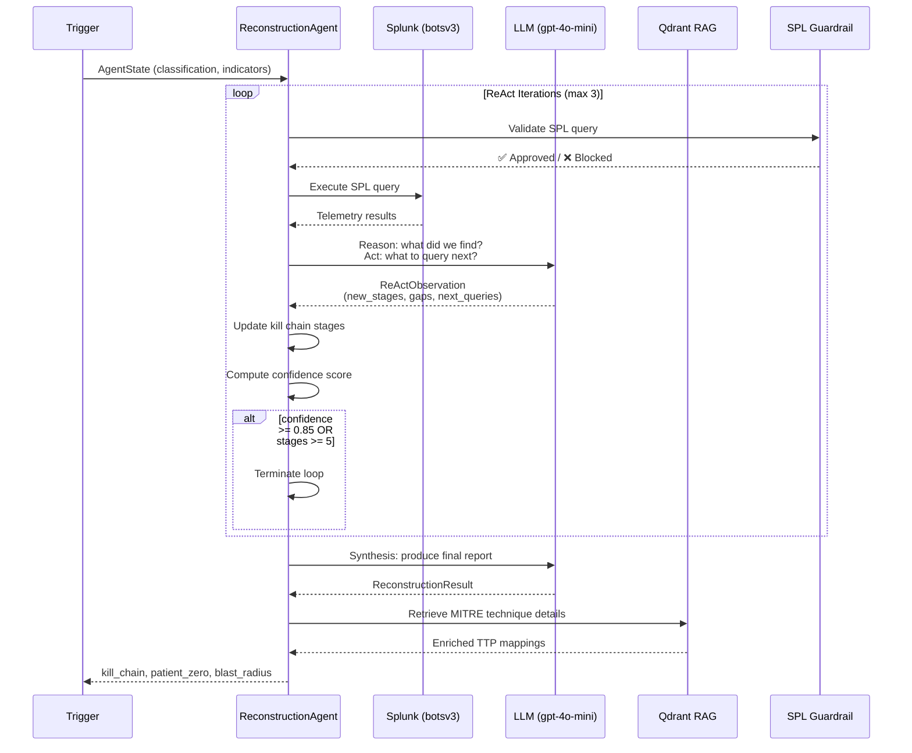
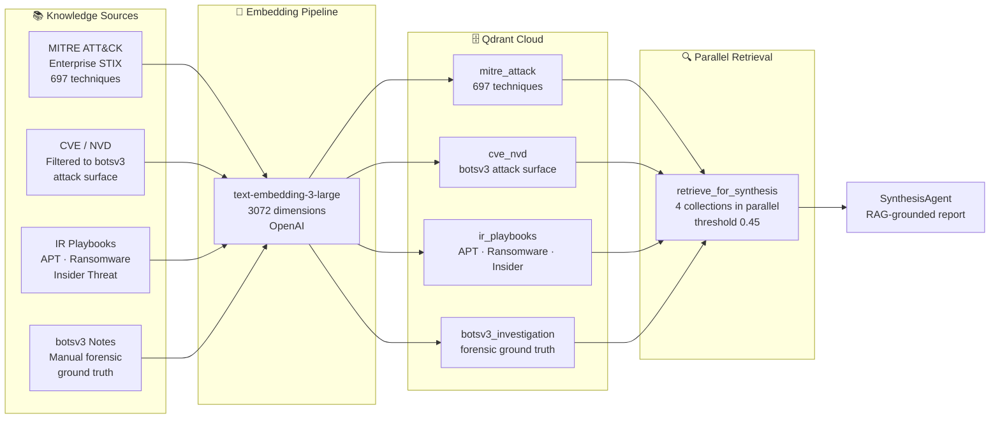
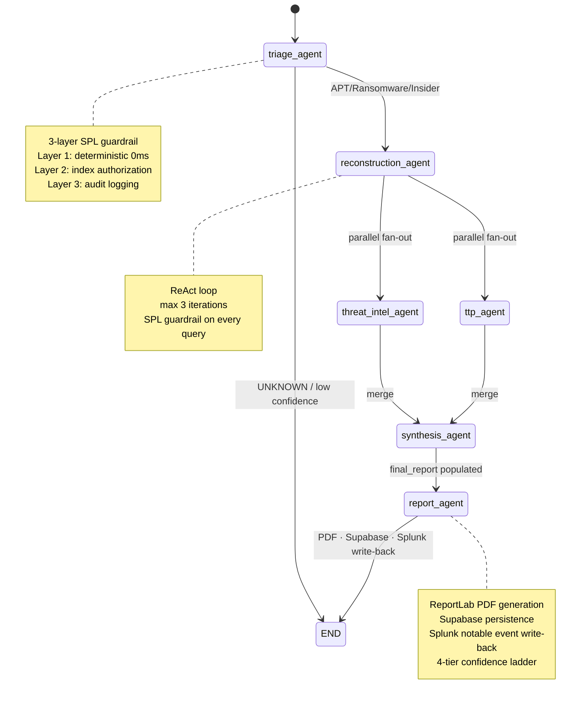
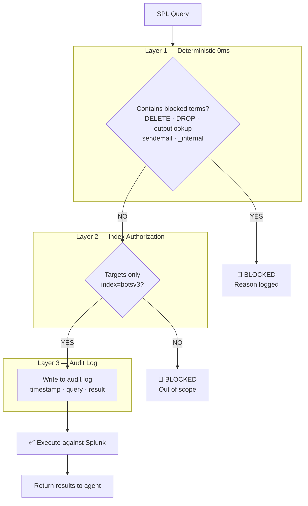
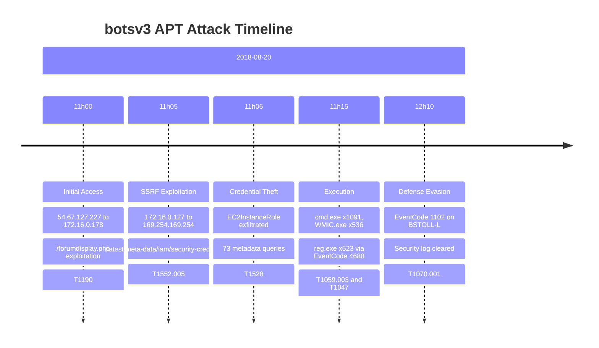

# Splunk Sentinel

> Autonomous AI-powered SOC investigation platform.
> A 4-hour manual investigation in 100 seconds —
> 6 specialized AI agents, ReAct kill chain
> reconstruction, and Splunk-native AI validation.


## Submission Links

- Devpost submission: https://devpost.com/software/splunk-sentinel
- Demo video: https://youtu.be/vdQYQY1cXFA?si=Vgykh75108fiCi5D
- Architecture: [architecture_diagram.md](./architecture_diagram.md)
- Splunk SDK usage: [SPLUNK_SDK_USAGE.md](./SPLUNK_SDK_USAGE.md)

## What Judges Can Verify In 10 Minutes

### Option A — Watch the demo video
Demo video: https://youtu.be/vdQYQY1cXFA?si=Vgykh75108fiCi5D

### Option B — Run it locally

**Required dependencies:**
Splunk Enterprise + botsv3, Python 3.12,
Node 20, OpenAI API key, Qdrant Cloud (free tier)

**Optional (graceful fallback if missing):**
- VirusTotal API key — threat intel shows
  "unavailable", pipeline continues
- AbuseIPDB API key — same fallback as above
- Langfuse account — falls back to hardcoded
  prompts, pipeline unaffected
- LangSmith API key — tracing disabled,
  pipeline unaffected
- Supabase — **recommended** for full report persistence, investigation
  history, analyst feedback, and reproducible report review. Without
  Supabase, a live investigation may run but persisted history and
  report storage will be unavailable.

> **Testing / API cost note:** Splunk Sentinel is open source and free to review, test, and use. Running the full AI investigation workflow locally requires the tester to provide their own OpenAI API key. The project itself does not charge any fee, does not require proprietary hardware, and uses `gpt-4o-mini` to keep per-investigation cost low. The public demo video shows the end-to-end workflow for reviewers who choose not to run the full local Splunk/OpenAI/Qdrant stack.

> **Platform note:** Shell commands below use Windows syntax.
> On macOS/Linux replace `.venv\Scripts\activate` with
> `source .venv/bin/activate` and `cd ..\frontend` with `cd ../frontend`.

**1. Clone and install**

```bash
git clone https://github.com/Asembris/splunk-sentinel.git
cd splunk-sentinel

# Backend
cd backend
python -m venv .venv
.venv\Scripts\activate        # Windows — see platform note above
pip install -r requirements.txt

# Frontend
cd ../frontend
npm install
```

**2. Configure .env**

Use `backend/app/.env.example` and set:

```env
SPLUNK_HOST=localhost
SPLUNK_PORT=8089
SPLUNK_USERNAME=your_splunk_username
SPLUNK_PASSWORD=your_splunk_password
OPENAI_API_KEY=sk-your_openai_api_key
QDRANT_URL=https://your-cluster.qdrant.io
QDRANT_API_KEY=your_qdrant_api_key
VIRUSTOTAL_API_KEY=your_virustotal_api_key
ABUSEIPDB_API_KEY=your_abuseipdb_api_key
SUPABASE_URL=https://your-project.supabase.co
SUPABASE_SERVICE_KEY=your_supabase_service_key
LANGCHAIN_API_KEY=your_langsmith_api_key
LANGCHAIN_TRACING_V2=true
LANGCHAIN_PROJECT=splunk-sentinel
LANGFUSE_PUBLIC_KEY=your_langfuse_public_key
LANGFUSE_SECRET_KEY=your_langfuse_secret_key
LANGFUSE_BASE_URL=https://cloud.langfuse.com
```

**3. Create Supabase table:**
For the full persisted demo/history/report workflow, complete the Supabase setup below.
Run `supabase_schema.sql` in your Supabase SQL Editor:
1. Go to your Supabase project dashboard
2. Click SQL Editor -> New Query
3. Paste the contents of `supabase_schema.sql`
4. Click Run
5. Expected: table created with 0 rows

**4. Install Splunk app (one click):**
Download `sentinel.spl` from the repo root and install:
1. Open Splunk UI at `http://localhost:8000`
2. Apps -> Manage Apps -> Install app from file
3. Upload `sentinel.spl`
4. Check "Upgrade app" if prompted
5. Restart Splunk when prompted

This automatically creates:
- `sentinel_findings` index
- `sentinel_actions` index
- MLTK `authorize.conf` capabilities
- Native Splunk dashboard at
  `/app/splunk_sentinel_app/sentinel_dashboard`

**5. Ingest RAG knowledge base (run once)**

```bash
# continuing from frontend/ after step 1
cd ../backend
.venv\Scripts\activate
python -m app.rag.ingest
```

**6. Start backend**

```bash
# from repo root — open a new terminal for this long-running process
cd backend
.venv\Scripts\activate
uvicorn app.main:app --host 0.0.0.0 --port 8001 --reload
```

**7. Start frontend**

```bash
# from repo root — open a new terminal for this long-running process
cd frontend
npm run dev
# http://localhost:5173
```

**8. Verify health**

`GET http://localhost:8001/api/health`

Expected:

```json
{
  "status": "ok",
  "splunk_connected": true,
  "splunk_version": "10.2.2",
  "prompt_versions": {
    "triage-agent": {"name": "triage-agent", "version": 1, "label": "production"},
    "synthesis-narrative": {"name": "synthesis-narrative", "version": 1, "label": "production"},
    "containment-refinement": {"name": "containment-refinement", "version": 1, "label": "production"}
  },
  "promptops": "langfuse"
}
```

> Current `/api/health` behavior: `promptops` currently returns
> `"langfuse"` unconditionally. If Langfuse credentials are missing or
> Langfuse is unreachable, `prompt_versions` entries may be empty objects
> while the prompt loader internally falls back to memory cache or built-in
> hardcoded prompts. The health endpoint exposes core prompt metadata only;
> it should not be read as a complete list of every prompt or as a full
> PromptOps fallback-state indicator.

**9. Run your first investigation**

`POST http://localhost:8001/api/investigate`

```json
{
  "trigger": "Suspicious outbound requests to AWS metadata endpoint detected from internal web server. Possible SSRF attack leading to IAM credential exposure.",
  "investigation_id": "judge-test-001"
}
```

Typical response includes:
- `classification` — attack type (e.g. APT, RANSOMWARE, INSIDER_THREAT, or UNKNOWN)
- `investigation_confidence` — numeric confidence score
- `kill_chain_stages` — reconstructed kill chain stages
- `ttp_mappings` — mapped MITRE ATT&CK techniques
- `containment_plan` — phased IR containment plan

**10. Run the test suite**

```bash
# from repo root
cd backend
.venv\Scripts\activate
python -m pytest tests/ --ignore=tests/eval/ -v
```

Expected: `425 passed, 0 failed`

## The Problem

SOC analysts investigating APT incidents spend 4+ hours manually
pivoting between data sources — running 15-20 sequential Splunk
queries, each informed by the last. During this time:

- **Alert fatigue** causes critical kill chain events to be missed
- **Manual correlation** across 2M+ events is error-prone and slow
- **Context switching** between tools breaks investigative flow
- **Dwell time increases** — attackers operate undetected for longer

The BOTS v3 dataset demonstrates this problem exactly: 2,083,056 log
events across 20 sourcetypes. A human analyst needs 3-4 hours to
reconstruct the kill chain. **Splunk Sentinel does it in ~100 seconds.**

## How It Works — Architecture Overview

### Full Agent Pipeline

```mermaid
graph TD
    A[🔔 Alert Trigger<br/>Splunk Webhook / User Prompt] --> B

    subgraph TRIAGE ["⚡ Phase 1 — Triage"]
        B[TriageAgent<br/>Classification · Confidence · SPL Routing]
    end

    subgraph RECONSTRUCTION ["🔍 Phase 2 — Reconstruction ReAct Loop"]
        C[ReconstructionAgent<br/>Iterative SPL Generation · Kill Chain Building<br/>Self-Correction · Patient Zero · Blast Radius]
    end

    subgraph PARALLEL ["⚡ Phase 3 — Parallel Enrichment"]
        D[ThreatIntelAgent<br/>VirusTotal · AbuseIPDB<br/>IP Reputation]
        E[TTPAgent<br/>MITRE ATT&CK RAG<br/>697 Techniques · CVE Lookup]
    end

    subgraph SYNTHESIS ["📊 Phase 4 — Synthesis"]
        F[SynthesisAgent<br/>RAG Retrieval · Evidence Citation<br/>Confidence Scoring · Report Generation]
    end

    subgraph REPORTING ["📋 Phase 5 — Reporting"]
        RA[ReportAgent<br/>PDF · Supabase · Splunk Write-back<br/>4-Tier Confidence Ladder]
    end

    B -->|APT/Ransomware/Insider| C
    B -->|UNKNOWN| Z[🔚 END — Escalate to Human]
    C --> D
    C --> E
    D --> F
    E --> F
    F --> RA[ReportAgent<br/>PDF Generation · Supabase · Splunk Write-back]
    RA --> G[📄 Complete Investigation Package<br/>PDF Report · Notable Event · Analyst Feedback]

    style TRIAGE fill:#1e3a5f,stroke:#3b82f6
    style RECONSTRUCTION fill:#1e3a5f,stroke:#3b82f6
    style PARALLEL fill:#1a2e1a,stroke:#10b981
    style SYNTHESIS fill:#2d1b1b,stroke:#ef4444
    style REPORTING fill:#1a1a2e,stroke:#8b5cf6
```



### ReAct Loop — ReconstructionAgent



### RAG Knowledge Pipeline



> **Evidence integrity note:** Kill-chain reconstruction is driven by Splunk telemetry and guarded SPL execution. The `botsv3_investigation` RAG collection is retrieved only during final synthesis to support explanation, remediation, and report context after reconstruction is complete.

### LangGraph State Machine



### 3-Layer SPL Guardrail



### Post-Pipeline Services



```mermaid
graph TD
    R[ReportAgent<br/>Investigation persisted] --> CE
    R --> ME

    subgraph POST ["Post-Pipeline Services (analyst-triggered)"]
        CE[containment_engine<br/>Phase execution + rollback]
        CC[containment_chat<br/>ContainmentRefinementAgent<br/>ReAct tool calling]
        CV[containment_verifier<br/>SPL verification of effects]
        DG[detection_gap_analyzer<br/>MITRE coverage analysis]
        ME[mltk_enrichment<br/>Async MLTK ai command validation]
    end

    CE --> CV
    CE --> CC
    R --> DG

    style POST fill:#1a1a2e,stroke:#8b5cf6
```

## Key Features

### Feature 1 — ReAct Kill Chain Reconstruction
ReconstructionAgent runs a bounded ReAct loop (max 3 iterations) to reason over telemetry, issue next SPL queries, self-correct query failures, and converge on a complete kill chain with patient zero and blast radius.

### Feature 2 — Explainable Confidence Scores
Deterministic 5-factor confidence, not LLM-generated:
- Kill chain completeness: `0.35`
- Evidence variety: `0.30`
- Patient zero identification: `0.10`
- External indicator evidence: `0.10`
- Blast radius assessment: `0.15`

Includes weakest-factor callout plus a concrete recommendation.

### Feature 3 — MLTK Async TTP Validation
After persistence, Splunk MLTK `ai` validates MITRE mappings asynchronously (~30s post-investigation). Validation runs in parallel and never blocks pipeline SLO. Qdrant/MLTK agreement boosts confidence using `Qdrant 60% + MLTK 40%`. UI updates via polling. MLTK validation runs as a post-investigation background enrichment step when Splunk MLTK 5.7.4 and the configured `openai_sentinel` connection are available. Techniques show `MLTK Validated`, `MLTK Review`, or `NOT RUN`. `NOT RUN` indicates enrichment has not completed or was not available for that investigation.

### Feature 4 — Containment Plan + Verification
3-phase IR plan (`IMMEDIATE`, `SHORT TERM`, `REMEDIATION`) with analyst edits, SSE execution, and rollback via reversal SPL. `containment_verifier` proves measurable effect with deterministic before/after SPL counts and verdicts:
- `VERIFIED_EFFECTIVE`
- `PARTIAL_EFFECT`
- `VERIFICATION_FAILED`
- `ROLLBACK_RECOMMENDED`

### Feature 5 — Conversational Containment Refinement
ContainmentRefinementAgent supports natural-language plan edits with ReAct tool calling, bulk operations, RFC1918 validation, deduplication, phase targeting, and conversation memory. Uses `fetch ReadableStream` SSE for Safari compatibility.

### Feature 6 — Detection Gap Analysis
Compares MITRE techniques against existing Splunk saved searches, identifies uncovered techniques, generates recommended detection SPL (LLM + templates), and deploys in one click through Splunk SDK. Includes cache, duplicate checks, and guardrails.

**Before/After Coverage Improvement:** After deploying a generated saved search, analysts can click Re-run Coverage to force-refresh the gap analysis (`force_refresh=true`). The UI shows a before/after panel with coverage percentage before Sentinel, coverage percentage after deployment, delta in percentage points, newly covered techniques, gaps closed, and saved searches checked before and after. This is the closed-loop SOC improvement story.

### Feature 7 — PromptOps via Langfuse
Core production prompts are managed in Langfuse (v1), with production/staging labels, startup validation, 5-minute TTL caching, memory fallback, and hardcoded fallback to prevent pipeline outages.

### Feature 8 — Parallel Agent Fan-Out
ThreatIntelAgent and TTPAgent run in parallel after reconstruction, reducing total latency versus sequential enrichment.

### Feature 9 — RAG-Grounded Reporting
Synthesis pulls from Qdrant (`697 MITRE + 50 CVEs + 15 IR playbooks`) to ground techniques, recommendations, and contextual explanations.

### Feature 10 — Tamper-Evident Audit Log
Every SPL query is recorded in a SHA-256 chain. Integrity is verifiable per investigation via API.

### Feature 11 — Full Observability
When configured, LangSmith traces LLM calls. Langfuse manages prompt versions. Cost is approximately **$0.009 per investigation** with `gpt-4o-mini` exclusively.

### Feature 12 — Durable LangGraph Checkpointing
The investigation graph uses AsyncSqliteSaver to checkpoint state at every node completion, keyed by `investigation_id` as `thread_id`. If the backend restarts mid-investigation, the graph resumes from the last completed node. Completed investigations are resumable via `POST /api/investigations/{id}/resume`. Check checkpoint status via `GET /api/investigations/{id}/checkpoint-status`. Backed by a local SQLite database at `backend/checkpoints.db` — suitable for single-node demo environments.

## Agent and Service Reference

### Investigation Pipeline (LangGraph)

| Agent | Role | Key Logic |
|-------|------|-----------|
| TriageAgent | Classification, severity, SPL routing | 3-layer guardrail, UNKNOWN routing |
| ReconstructionAgent | Kill chain, patient zero, blast radius | ReAct max 3 iter, SPL self-correction |
| ThreatIntelAgent | IP reputation | VirusTotal + AbuseIPDB parallel, RFC1918 filter |
| TTPAgent | MITRE mapping + MLTK validation | Qdrant RAG + async MLTK enrichment |
| SynthesisAgent | Report generation | 4 parallel LLM calls, graceful degradation |
| ReportAgent | PDF, Supabase, Splunk write-back | MLTK task fire, containment persistence |

### Post-Pipeline Services

| Service | Trigger | Role |
|---------|---------|------|
| containment_engine | Analyst executes phase | SPL execution, sentinel_actions write |
| containment_chat | Analyst chat message | ContainmentRefinementAgent ReAct |
| containment_verifier | After action executes | SPL before/after verification |
| detection_gap_analyzer | Analyst opens gaps panel | MITRE coverage vs saved searches |
| mltk_enrichment | After investigation persists | Async MLTK ai command TTP validation |

## Splunk Integration

### Autonomous Alert Webhook
Configure Splunk alert actions to call Sentinel for autonomous investigations from detections.

### Splunk Write-back
Completed investigations are written back to `index=sentinel_findings`.

### MLTK AI Toolkit Integration
MLTK `5.7.4` + PSC `4.3.2` with Connection Management (`openai_sentinel`, `gpt-4o-mini`):

```spl
| makeresults count=1
| eval evidence="..."
| ai connection="openai_sentinel"
    prompt="Validate MITRE technique: {qdrant_technique}..."
```

Results enrich report content asynchronously after investigation completion.

### Detection Gap Deployment
One-click deployment creates Splunk saved searches:

```spl
| rest /services/saved/searches
| where match(title, "Sentinel")
| table title, updated
```

### Containment Actions Audit
Every action execution and verification is auditable:

```spl
index=sentinel_actions earliest=0
| table investigation_id, action_type, target,
        status, executed_at, verification_verdict
| sort -executed_at
```

## API Reference

### Core investigation

| Method | Endpoint | Description |
|---|---|---|
| `POST` | `/api/investigate` | Start a new investigation (JSON/SSE) |
| `POST` | `/api/webhook/splunk` | Splunk autonomous trigger |
| `GET` | `/api/webhook/splunk/test` | Webhook connectivity test |
| `GET` | `/api/health` | Health and Splunk connectivity |
| `GET` | `/api/investigations/history` | Investigation history with pagination and search |
| `GET` | `/api/investigations/{id}` | Investigation details |
| `POST` | `/api/investigations/{id}/feedback` | Analyst feedback |
| `GET` | `/api/investigations/{id}/report/pdf` | Download PDF |

### Analysis

| Method | Endpoint | Description |
|---|---|---|
| `GET` | `/api/investigations/{id}/confidence-breakdown` | Explainable confidence factors |
| `GET` | `/api/investigations/{id}/ttp-enrichment` | Async MLTK enrichment status/results |
| `GET` | `/api/investigations/{id}/detection-gaps` | MITRE coverage analysis |
| `POST` | `/api/investigations/{id}/detection-gaps/deploy` | Deploy saved search |

### Containment

| Method | Endpoint | Description |
|---|---|---|
| `GET` | `/api/investigations/{id}/containment-plan` | Load plan |
| `GET` | `/api/investigations/{id}/containment-plan/execute` | SSE stream for phase execution (EventSource / browser) |
| `POST` | `/api/investigations/{id}/containment-plan/execute` | Execute phase (non-browser clients) |
| `POST` | `/api/investigations/{id}/containment-plan/rollback` | Rollback action |
| `GET` | `/api/investigations/{id}/containment-plan/chat/init` | Init chat |
| `POST` | `/api/investigations/{id}/containment-plan/chat` | Refinement chat |

### Audit

| Method | Endpoint | Description |
|---|---|---|
| `GET` | `/api/audit-log` | Full audit log entries |
| `GET` | `/api/audit-log/verify/{id}` | Verify audit chain for investigation |
| `GET` | `/api/audit-log/verify-latest` | Verify latest investigation |

### Checkpointing

| Method | Endpoint | Description |
|---|---|---|
| `GET` | `/api/investigations/{id}/checkpoint-status` | Check if checkpoint exists and investigation completion state |
| `POST` | `/api/investigations/{id}/resume` | Resume investigation from last checkpoint |

### Monitoring

| Method | Endpoint | Description |
|---|---|---|
| `GET` | `/api/slo/status` | Pipeline SLO and latency metrics |

## Evaluation Results

### TriageAgent — Golden Evaluation Cases

15 golden test cases covering APT, ransomware, insider threat, UNKNOWN escalation, and hallucination traps. Results vary based on environment and model temperature. Re-run offline evals with:

```bash
python -m pytest tests/eval/ -v
```

Requires live Splunk, running backend, and OPENAI_API_KEY configured.

### Unit Test Coverage

425 passing backend tests including parametrized expansions across guardrails, reconstruction, containment, detection gap analyzer, confidence breakdown, containment verifier, API contracts, audit, parallel agents, schema, synthesis, and trigger categorization.

Run with `python -m pytest tests/ --ignore=tests/eval/ -v`.

### LangSmith Pipeline Trace

| Step | Latency | Tokens | Cost |
|:---|:---|:---|:---|
| triage_agent | 27.3s | 3.5K | ~$0.001 |
| reconstruction_agent (3 ReAct iters) | 70.1s | 40.6K | ~$0.006 |
| threat_intel_agent | 0.4s | — | — |
| ttp_agent | 3.3s | — | — |
| synthesis_agent | 9.9s | 6.3K | ~$0.001 |
| report_agent | ~5s | — | — |
| **Total** | **~100s** | **~50.4K** | **~$0.009** |

## Security Design

### Read-Only Agent Operation

The investigation agent operates in strict read-only mode against
`index=botsv3` exclusively. Three layers of protection enforce this:

**Layer 1 — Deterministic keyword blocking (0ms, zero LLM calls)**
Blocked terms: `| delete`, `delete-index`, `| outputlookup overwrite=true`,
`| sendemail`, `DROP`, `TRUNCATE`, `index=_internal`, `index=_audit`

**Layer 2 — Index authorization**  
Every SPL query is validated to target only `index=botsv3`. Queries
targeting production indexes, internal Splunk indexes, or customer
data are blocked before execution.

**Layer 3 — Immutable audit log**
Every query attempt (whether blocked or executed) is timestamped and
logged with: `timestamp`, `investigation_id`, `query`, `layer1_result`,
`layer2_result`, `executed`, `results_count`. This log cannot be
modified by the agent.

### Confidence-Gated Escalation

Investigations with `reconstruction_confidence < 0.5` or
`severity = CRITICAL` automatically set `escalate_to_human = True`.
The system never produces a high-confidence report from low-quality
evidence — it escalates instead.

### Hash-Chained Audit Log

Every SPL query attempt — whether blocked or executed — is
recorded as a tamper-evident entry in a SHA-256 hash chain.
Each entry contains:

- `prev_hash` — hash of the previous entry (genesis: `"0"*64`)
- `entry_hash` — SHA-256 of `prev_hash + canonical(entry content)`
- `correction_attempts` — number of LLM self-correction rewrites
- `was_corrected` — whether the query was rewritten before execution
- `rows_returned` — result count for executed queries

Modifying any entry invalidates all subsequent hashes, making
tampering immediately detectable. The `GET /api/audit-log/verify/{id}` and `GET /api/audit-log/verify-latest`
endpoints provide real-time chain integrity verification.

### Splunk Notable Event Write-back

When an investigation completes, ReportAgent writes a structured
notable event to `index=sentinel_findings` via the Splunk Python
SDK. The event includes the full kill chain summary, confidence
tier, patient zero, and immediate recommended actions — making
Sentinel findings searchable in Splunk alongside native alerts:

```spl
index=sentinel_findings sourcetype="sentinel:investigation"
| table investigation_id, classification, confidence_tier,
        kill_chain_summary, patient_zero_ip, severity
```

## BOTS v3 Attack Scenario

The system is evaluated against the Boss of the SOC v3 dataset —
a realistic APT simulation used in Splunk .conf competitions.

### Dataset
- **Total events:** 2,083,056
- **Sourcetypes:** 20 (stream:http, stream:dns, WinEventLog:Security, osquery, syslog, ...)
- **Attack window:** 2018-08-20 to 2019-09-19
- **Peak hour:** 2018-08-20 15:00 (443,808 events)

### Confirmed Kill Chain (botsv3 Ground Truth)



### Key IOCs

| IOC | Value | Role |
|:---|:---|:---|
| External attacker IPs | 54.67.127.227, 184.85.20.125, 23.73.195.90 | Initial access |
| Internal SSRF source | 172.16.0.127, 172.31.12.76 | Compromised web server |
| Metadata endpoint | 169.254.169.254 | AWS credential theft target |
| Metadata URI | /latest/meta-data/iam/security-credentials/EC2InstanceRole | Stolen credential path |
| Compromised host | BSTOLL-L | EventCode 1102 — log cleared |
| Compromised account | BSTOLL | Admin privileges |
| Dominant EventCodes | 5156 (11,501), 4688 (7,427), 4673 (4,122) | Key investigation signals |

## Getting Started

> Note: This project requires Splunk Enterprise
> with the botsv3 dataset. If you cannot run
> it locally, the demo video shows the complete
> investigation flow end to end.

### Option A — Watch the demo video
Demo video: https://youtu.be/vdQYQY1cXFA?si=Vgykh75108fiCi5D

### Option B — Run locally with full commands

> **Platform note:** Commands below use Windows syntax.
> On macOS/Linux replace `.venv\Scripts\activate` with
> `source .venv/bin/activate` and path separators accordingly.

#### 1) Clone repository

```bash
git clone https://github.com/Asembris/splunk-sentinel.git
cd splunk-sentinel
```

#### 2) Backend setup

```bash
cd backend
python -m venv .venv
.venv\Scripts\activate
pip install -r requirements.txt
```

#### 3) Frontend setup

```bash
cd ../frontend
npm install
```

#### 4) Configure environment
Create `backend/app/.env` from `backend/app/.env.example` with:

- `SPLUNK_HOST`
- `SPLUNK_PORT`
- `SPLUNK_USERNAME`
- `SPLUNK_PASSWORD`
- `OPENAI_API_KEY`
- `QDRANT_URL`
- `QDRANT_API_KEY`
- `VIRUSTOTAL_API_KEY`
- `ABUSEIPDB_API_KEY`
- `SUPABASE_URL`
- `SUPABASE_SERVICE_KEY`
- `LANGCHAIN_API_KEY`
- `LANGCHAIN_TRACING_V2`
- `LANGCHAIN_PROJECT`
- `LANGFUSE_PUBLIC_KEY`
- `LANGFUSE_SECRET_KEY`
- `LANGFUSE_BASE_URL`

#### 5) Create Supabase table

For the full persisted demo/history/report workflow, complete the Supabase setup below.
Run `supabase_schema.sql` in your Supabase SQL Editor:
1. Go to your Supabase project at supabase.com/dashboard
2. SQL Editor -> New Query
3. Paste the full contents of `supabase_schema.sql`
4. Click Run

#### 6) Install Splunk app (one click)

Download `sentinel.spl` from the repo root and install:
1. Open Splunk UI at `http://localhost:8000`
2. Apps -> Manage Apps -> Install app from file
3. Upload `sentinel.spl`
4. Check "Upgrade app" if prompted
5. Restart Splunk when prompted

This automatically creates:
- `sentinel_findings` index
- `sentinel_actions` index
- MLTK `authorize.conf` capabilities
- Native Splunk dashboard at
  `/app/splunk_sentinel_app/sentinel_dashboard`

#### 7) Ingest RAG data (one-time)

```bash
# continuing from frontend/ after step 3
cd ../backend
.venv\Scripts\activate
python -m app.rag.ingest
```

#### 8) Run backend

```bash
# from repo root — open a new terminal for this long-running process
cd backend
.venv\Scripts\activate
uvicorn app.main:app --host 0.0.0.0 --port 8001 --reload
```

#### 9) Run frontend

```bash
# from repo root — open a new terminal for this long-running process
cd frontend
npm run dev
```

Open: `http://localhost:5173`

#### 10) Verify health endpoint

```bash
curl http://localhost:8001/api/health
```

Expect:
- `"status": "ok"`
- `"splunk_connected": true`
- `"splunk_version": "10.2.2"`
- `"promptops": "langfuse"`
- prompt versions metadata

#### 11) Run investigation

```bash
curl -X POST http://localhost:8001/api/investigate ^
  -H "Content-Type: application/json" ^
  -d "{\"trigger\":\"Suspicious outbound requests to AWS metadata endpoint detected from internal web server. Possible SSRF attack leading to IAM credential exposure.\",\"investigation_id\":\"judge-test-001\"}"
```

Typical response includes:
- `classification` — attack type (e.g. APT, RANSOMWARE, INSIDER_THREAT, or UNKNOWN)
- `investigation_confidence` — numeric confidence score
- `kill_chain_stages` — reconstructed kill chain stages
- `ttp_mappings` — mapped MITRE ATT&CK techniques
- `containment_plan` — phased IR containment plan

#### 12) Run tests

```bash
# from repo root
cd backend
.venv\Scripts\activate
python -m pytest tests/ --ignore=tests/eval/ -v
```

Expected: `425 passed, 0 failed`

## Tech Stack

| Layer | Technology | Version | Purpose |
|:---|:---|:---|:---|
| Agent Orchestration | LangGraph | 0.2 | State machine + parallel fan-out |
| LLM | GPT-4o-mini | OpenAI | SPL generation, reasoning, synthesis |
| Security Platform | Splunk Enterprise | 10.2.2 | Log ingestion + search execution |
| Dataset | BOTS v3 | — | 2,083,056 events |
| Vector Store | Qdrant Cloud | 1.11 | RAG retrieval |
| Embeddings | text-embedding-3-large | 3072 dims | Semantic search |
| Backend | FastAPI | 0.115 | REST API + SSE streaming |
| Frontend | React 18 + Vite | React 18 / Vite | Real-time dashboard |
| Persistence | Supabase | PostgreSQL | Investigation storage (JSONB) |
| PromptOps | Langfuse | 3.14.6 | Prompt versioning + validation |
| AI Toolkit | Splunk MLTK | 5.7.4 | Native Splunk AI command |
| ML Runtime | Python for Scientific Computing | 4.3.2 | MLTK dependency |
| Checkpointing | SQLite via AsyncSqliteSaver | — | Durable graph state per investigation |
| Tracing | LangSmith | — | End-to-end LLM traces |

## Documentation

- [FINDINGS.md](FINDINGS.md) — 10 technical findings
  including MLTK latency analysis, SPL guardrail design,
  Langfuse PromptOps, and containment verification
- [SPLUNK_SDK_USAGE.md](SPLUNK_SDK_USAGE.md) — Complete
  Splunk SDK integration guide including SDK reconnect,
  saved-search deployment, before/after coverage, MLTK
  syntax, and local certificate notes
- [architecture_diagram.md](architecture_diagram.md) —
  System architecture overview

## Hackathon Compliance Notes

- Public open-source repository with a root `LICENSE` file.
- Architecture diagram included in [`architecture_diagram.md`](./architecture_diagram.md).
- Runtime Splunk integration through the Splunk Python SDK, guarded SPL execution, saved-search deployment, and write-back to `sentinel_findings` / `sentinel_actions`.
- Splunk AI capability path documented through asynchronous MLTK `ai` enrichment when Splunk MLTK and the `openai_sentinel` connection are configured.
- The submitted project was substantially developed and polished during the hackathon period, as reflected in commit history.

## License

MIT — see [LICENSE](LICENSE)

## Acknowledgements

- [Splunk BOTS v3](https://github.com/splunk/botsv3) — Ryan Kovar et al.
- [MITRE ATT&CK](https://attack.mitre.org/) — MITRE Corporation
- [LangGraph](https://github.com/langchain-ai/langgraph) — LangChain
- [Qdrant](https://qdrant.tech/) — Vector similarity search
- [DeepEval](https://github.com/confident-ai/deepeval) — LLM evaluation
- [vis-network](https://visjs.github.io/vis-network/docs/network/) — Graph visualization
- Langfuse — Prompt management
- Supabase — Investigation persistence
- Splunk MLTK — AI Toolkit integration
