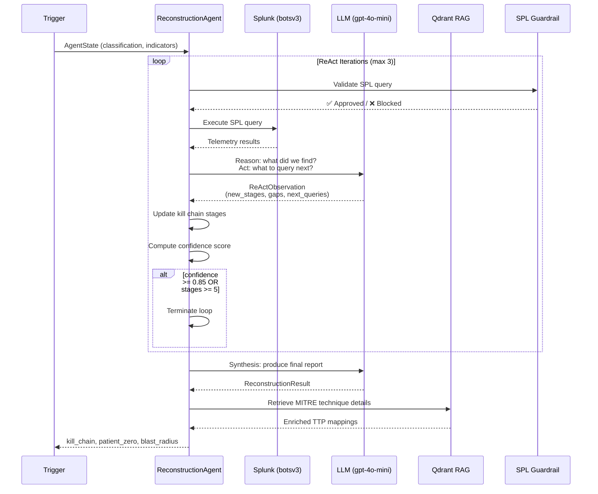
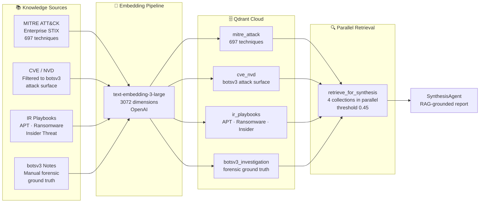
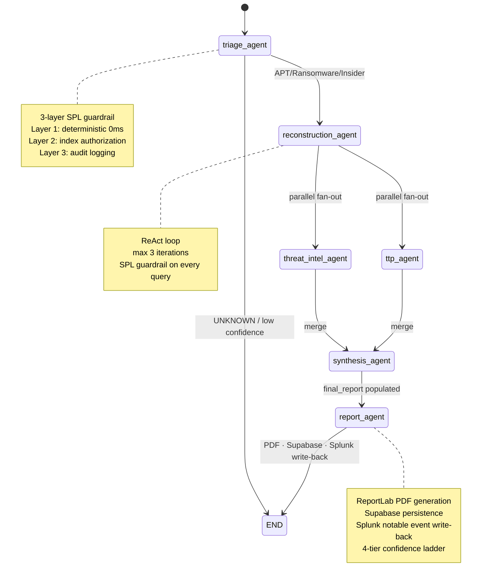
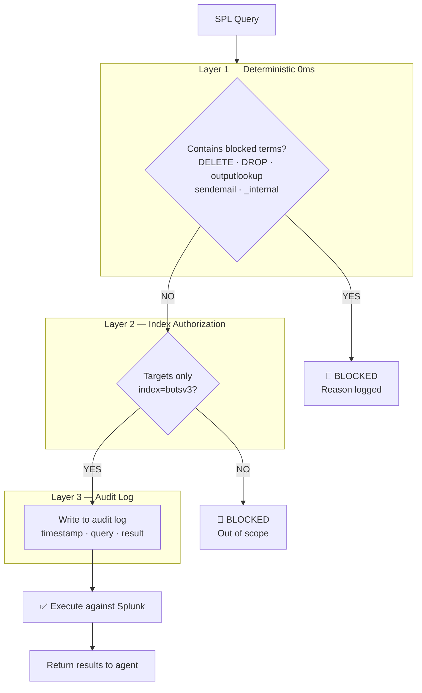
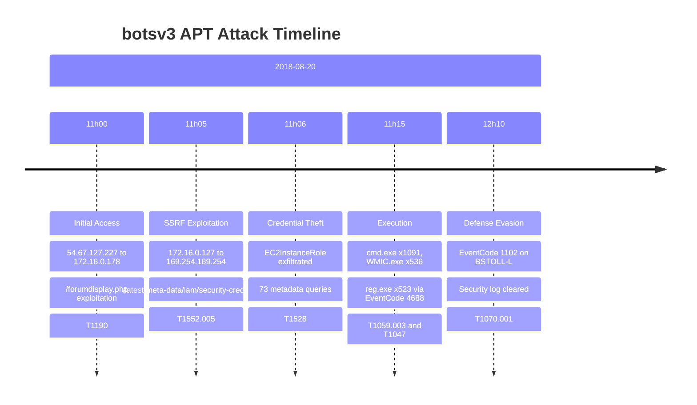

# 🛡️ Splunk Sentinel

> **Autonomous AI-powered SOC investigation platform.**  
> Transforms a 4-hour manual security investigation into 90 seconds of 
> fully autonomous kill chain reconstruction — powered by 6 specialized 
> AI agents, a ReAct reasoning loop, and a 697-technique MITRE ATT&CK 
> knowledge base.

<!-- Badges row 1: core stack -->


<!-- Badges row 2: AI and data -->


<!-- Badges row 3: quality -->


## Live Demo

| Investigation Dashboard | Kill Chain Graph |
|:---:|:---:|
|  |  |

| Incident Report | Investigation History |
|:---:|:---:|
|  |  |

> **Demo:** Enter any security alert trigger → watch 6 AI agents 
> reconstruct the full attack kill chain in real time.

## The Problem

SOC analysts investigating APT incidents spend 4+ hours manually 
pivoting between data sources — running 15-20 sequential Splunk 
queries, each informed by the last. During this time:

- **Alert fatigue** causes critical kill chain events to be missed
- **Manual correlation** across 2M+ events is error-prone and slow  
- **Context switching** between tools breaks investigative flow
- **Dwell time increases** — attackers operate undetected for longer

The BOTS v3 dataset demonstrates this problem exactly: 2,083,056 log 
events across 20 sourcetypes. A human analyst needs 3-4 hours to 
reconstruct the kill chain. **Splunk Sentinel does it in 90 seconds.**

## Architecture

### Full Agent Pipeline

```mermaid
graph TD
    A[🔔 Alert Trigger<br/>Splunk Webhook / User Prompt] --> B

    subgraph TRIAGE ["⚡ Phase 1 — Triage"]
        B[TriageAgent<br/>Classification · Confidence · SPL Routing]
    end

    subgraph RECONSTRUCTION ["🔍 Phase 2 — Reconstruction ReAct Loop"]
        C[ReconstructionAgent<br/>Iterative SPL Generation · Kill Chain Building<br/>Self-Correction · Patient Zero · Blast Radius]
    end

    subgraph PARALLEL ["⚡ Phase 3 — Parallel Enrichment"]
        D[ThreatIntelAgent<br/>VirusTotal · AbuseIPDB<br/>IP Reputation]
        E[TTPAgent<br/>MITRE ATT&CK RAG<br/>697 Techniques · CVE Lookup]
    end

    subgraph SYNTHESIS ["📊 Phase 4 — Synthesis"]
        F[SynthesisAgent<br/>RAG Retrieval · Evidence Citation<br/>Confidence Scoring · Report Generation]
    end

    subgraph REPORTING ["📋 Phase 5 — Reporting"]
        RA[ReportAgent<br/>PDF · Supabase · Splunk Write-back<br/>4-Tier Confidence Ladder]
    end

    B -->|APT/Ransomware/Insider| C
    B -->|UNKNOWN| Z[🔚 END — Escalate to Human]
    C --> D
    C --> E
    D --> F
    E --> F
    F --> RA[ReportAgent<br/>PDF Generation · Supabase · Splunk Write-back]
    RA --> G[📄 Complete Investigation Package<br/>PDF Report · Notable Event · Analyst Feedback]

    style TRIAGE fill:#1e3a5f,stroke:#3b82f6
    style RECONSTRUCTION fill:#1e3a5f,stroke:#3b82f6
    style PARALLEL fill:#1a2e1a,stroke:#10b981
    style SYNTHESIS fill:#2d1b1b,stroke:#ef4444
    style REPORTING fill:#1a1a2e,stroke:#8b5cf6
```



### ReAct Loop — ReconstructionAgent



### RAG Knowledge Pipeline



### LangGraph State Machine



### 3-Layer SPL Guardrail



## Key Technical Differentiators

### 1. ReAct Loop Kill Chain Reconstruction

The ReconstructionAgent implements a full Reasoning + Acting loop — 
the same pattern used in production AI agents at major tech companies.
Each iteration:

1. **Observe** — execute SPL queries against botsv3 (2M+ events)
2. **Reason** — LLM analyzes results: what stages are confirmed?
3. **Act** — generate next targeted SPL query to fill gaps
4. **Self-correct** — if SPL fails, LLM rewrites it automatically
5. **Terminate** — when confidence ≥ 0.85 or kill chain is complete

This is fundamentally different from fixed-query systems. The agent 
adapts its investigation based on what it finds — exactly as a senior 
SOC analyst would.

### 2. Deterministic Confidence Scoring

Every kill chain stage and finding has a mathematically computed 
confidence score — never hallucinated by an LLM:

```python
def compute_reconstruction_confidence(
    confirmed_stages: int,    # 0.35 weight
    sourcetypes_covered: set, # 0.30 weight  
    has_patient_zero: bool,   # 0.10 weight
    has_external_ip: bool,    # 0.10 weight
    has_blast_radius: bool,   # 0.15 weight
) -> float:
    # Capped at 0.95 — never 1.0
```

### 3. Parallel Agent Fan-Out

ThreatIntelAgent and TTPAgent execute simultaneously after 
ReconstructionAgent completes, using LangGraph's Send API. 
Adding external API enrichment adds only 4-6 seconds of latency 
(parallel execution) rather than 8-12 seconds (sequential).

### 4. RAG-Grounded Reporting

SynthesisAgent retrieves from all 4 Qdrant collections in parallel 
before generating the final report. Every recommended action is 
grounded in IR playbook content. Every MITRE technique citation 
is backed by the 697-technique knowledge base. The agent is 
explicitly instructed to never cite CVEs not present in RAG context.

### 5. Full Observability

Every LLM call, SPL query, and agent transition is traced in 
LangSmith with token counts, latency, and cost. A complete 
investigation costs approximately $0.009 in API calls.

### 6. Production-Grade Test Coverage

- **169 unit tests** — all deterministic, no LLM/Splunk dependencies
- **DeepEval adversarial suite** — 15 goldens, 93.3% pass rate
- **Hallucination traps** — agent correctly refuses to classify 
  when telemetry contradicts the trigger
- **Guardrail bypass tests** — adversarial SPL injection attempts

### 7. Closed-Loop Autonomous SOC Integration

ReportAgent closes the complete autonomous investigation loop:

1. **PDF Generation** — ReportLab produces a structured incident 
   report with kill chain timeline, MITRE ATT&CK mapping, key 
   findings, recommended actions, and the full SPL audit log
2. **Supabase Persistence** — every investigation is persisted 
   permanently, enabling cross-session history and analyst feedback
3. **Splunk Write-back** — investigation findings are written back 
   to Splunk as notable events in `index=sentinel_findings`, 
   completing the detection → investigation → response loop
4. **4-Tier Confidence Ladder** — actions are gated by confidence:
   - `≥ 0.90` → AUTO_ESCALATE (notable event + containment SPL)
   - `0.70–0.89` → ANALYST_REVIEW (human review recommended)
   - `0.60–0.70` → MONITOR (watch for escalation)
   - `< 0.60` → ESCALATE_TO_HUMAN (manual investigation required)
5. **Analyst Feedback Loop** — analysts rate each investigation 
   (Correct / Partial / Incorrect) with notes, building a ground 
   truth dataset for confidence formula calibration

### 8. Tamper-Evident Hash-Chained Audit Log

Every SPL query executed by any agent is recorded in a 
cryptographically chained audit log:

```python
entry_hash = SHA-256(prev_hash + canonical_entry_json)
```

Each entry's hash depends on all previous entries — modifying, 
deleting, or inserting any entry breaks the chain from that 
point forward. The integrity of any investigation's audit trail 
can be verified via:

```
GET /api/audit-log/verify/{investigation_id}
→ {"valid": true, "total_entries": 16, "chain_intact": true}
```

No other agent framework in the AI security space provides
cryptographic integrity guarantees on the audit log — documented
in FINDINGS.md.

## Agent Pipeline

| Agent | Status | Inputs | Outputs | Key Logic |
|:---|:---|:---|:---|:---|
| **TriageAgent** | ✅ Complete | Alert trigger | classification, severity, attack_window, top_source_ips | SPL routing by attack type, 4625 count < 20 → never BRUTE_FORCE, CRITICAL → force escalate |
| **ReconstructionAgent** | ✅ Complete | Triage outputs | kill_chain, patient_zero, blast_radius, attack_narrative | ReAct loop max 3 iter, seed queries per classification, SPL self-correction |
| **ThreatIntelAgent** | ✅ Complete | blast_radius.external_ips | threat_intel per IP | VirusTotal + AbuseIPDB parallel, RFC1918 filter, deterministic fallback |
| **TTPAgent** | ✅ Complete | kill_chain MITRE codes | ttp_mappings enriched | Qdrant exact ID lookup + semantic fallback, CVE linking |
| **SynthesisAgent** | ✅ Complete | All upstream outputs | final_report | Parallel LLM calls, RAG 4-collection retrieval, field injection fallbacks |
| **ReportAgent** | ✅ Complete | final_report | PDF report, Supabase record, Splunk notable event | ReportLab PDF generation, Supabase persistence, Splunk write-back via SDK, 4-tier confidence ladder |

## Evaluation Results

### TriageAgent — DeepEval Suite

| Golden | Classification | Confidence | Status |
|:---|:---|:---|:---|
| APT SSRF + IAM credential theft | APT | 0.90 | ✅ Pass |
| DNS tunneling C2 beaconing | APT | 0.90 | ✅ Pass |
| C2 beaconing periodic connections | APT | 0.90 | ✅ Pass |
| WMIC + cmd.exe ransomware staging | RANSOMWARE | 0.80 | ✅ Pass |
| Shadow copy deletion + lateral movement | RANSOMWARE | 0.90 | ✅ Pass |
| reg.exe + svchost.exe execution chain | RANSOMWARE | 0.80 | ✅ Pass |
| EventCode 4673 privilege abuse | INSIDER_THREAT | 0.80 | ✅ Pass |
| Mass file access EventCode 4670 | INSIDER_THREAT | 0.80 | ✅ Pass |
| Special privileges EventCode 4672 | INSIDER_THREAT | 0.80 | ✅ Pass |
| Vague trigger (UNKNOWN) | UNKNOWN | 0.35 | ✅ Pass |
| Empty trigger (UNKNOWN) | UNKNOWN | 0.35 | ✅ Pass |
| **Hallucination trap**: 847 failed logins | UNKNOWN | 0.30 | ✅ Pass |
| Multi-vector SSRF + DNS tunnel | APT | 0.90 | ✅ Pass |
| CRITICAL ransomware guardrail | RANSOMWARE | 0.90 | ✅ Pass |
| Confidence cap regression | APT | 0.95 | ✅ Pass |

**Pass rate: 14/15 (93.3%) at 0.7 threshold with gpt-4o-mini judge**

### Unit Test Coverage

| Module | Tests | Coverage |
|:---|:---|:---|
| TriageAgent (guardrails, schema, routing) | 73 | Deterministic |
| ReconstructionAgent (confidence, Pydantic, guardrails) | 44 | Deterministic |
| ThreatIntelAgent + TTPAgent (RFC1918, threat level, MITRE extraction) | 52 | Deterministic |
| **Total** | **169** | **169/169 passing** |

### LangSmith Pipeline Trace

| Step | Latency | Tokens | Cost |
|:---|:---|:---|:---|
| triage_agent | 27.3s | 3.5K | ~$0.001 |
| reconstruction_agent (3 ReAct iters) | 70.1s | 40.6K | ~$0.006 |
| threat_intel_agent | 0.4s | — | — |
| ttp_agent | 3.3s | — | — |
| synthesis_agent | 9.9s | 6.3K | ~$0.001 |
| report_agent | ~5s | — | — |
| **Total** | **~99s** | **~50.4K** | **~$0.009** |

## BOTS v3 Attack Scenario

The system is evaluated against the Boss of the SOC v3 dataset — 
a realistic APT simulation used in Splunk .conf competitions.

### Dataset
- **Total events:** 2,083,056
- **Sourcetypes:** 20 (stream:http, stream:dns, WinEventLog:Security, osquery, syslog, ...)
- **Attack window:** 2018-08-20 to 2019-09-19
- **Peak hour:** 2018-08-20 15:00 (443,808 events)

### Confirmed Kill Chain (botsv3 Ground Truth)



### Key IOCs

| IOC | Value | Role |
|:---|:---|:---|
| External attacker IPs | 54.67.127.227, 184.85.20.125, 23.73.195.90 | Initial access |
| Internal SSRF source | 172.16.0.127, 172.31.12.76 | Compromised web server |
| Metadata endpoint | 169.254.169.254 | AWS credential theft target |
| Metadata URI | /latest/meta-data/iam/security-credentials/EC2InstanceRole | Stolen credential path |
| Compromised host | BSTOLL-L | EventCode 1102 — log cleared |
| Compromised account | BSTOLL | Admin privileges |
| Dominant EventCodes | 5156 (11,501), 4688 (7,427), 4673 (4,122) | Key investigation signals |

## Getting Started

### Prerequisites

- Python 3.12+
- Node.js 18+
- Splunk Enterprise 9.x or 10.x (local instance)
- BOTS v3 dataset installed in Splunk
- OpenAI API key
- Qdrant Cloud account (free tier sufficient)
- VirusTotal API key (free tier)
- AbuseIPDB API key (free tier)

### Backend Setup

```bash
git clone https://github.com/Asembris/splunk-sentinel.git
cd splunk-sentinel/backend

# Create virtual environment
python -m venv .venv
.venv\Scripts\activate      # Windows
# source .venv/bin/activate  # macOS/Linux

# Install dependencies
pip install -r requirements.txt

# Configure environment
cp .env.example .env
# Edit .env with your credentials

# Ingest RAG knowledge base (run once)
python -m app.rag.ingest

# Start backend
uvicorn app.main:app --host 0.0.0.0 --port 8001 --reload
```

### Frontend Setup

```bash
cd splunk-sentinel/frontend
npm install
npm run dev
# → http://localhost:5173
```

### Environment Variables

```env
# Splunk
SPLUNK_HOST=localhost
SPLUNK_PORT=8089
SPLUNK_USERNAME=admin
SPLUNK_PASSWORD=your_password

# OpenAI
OPENAI_API_KEY=sk-...

# Qdrant
QDRANT_URL=https://your-cluster.qdrant.io
QDRANT_API_KEY=your_key

# Threat Intel (free tier)
VIRUSTOTAL_API_KEY=your_key
ABUSEIPDB_API_KEY=your_key

# Observability (optional)
LANGCHAIN_API_KEY=your_key
LANGCHAIN_TRACING_V2=true
LANGCHAIN_PROJECT=splunk-sentinel
```

### Run Tests

```bash
cd backend

# Unit tests (169 tests, no external dependencies)
python -m pytest tests/ --ignore=tests/eval/ -v

# DeepEval suite (requires backend running on 8001)
python -m pytest tests/eval/test_triage_eval.py -v -s
```

## Splunk Integration

### Autonomous Alert Webhook

Configure Splunk to automatically trigger investigations when
saved search thresholds are breached:

1. **Settings → Searches, Reports, and Alerts → New Alert**
2. Set your detection SPL query
3. Alert action: **Webhook → URL:** `http://localhost:8001/api/webhook/splunk`
4. Save

When the alert fires, Splunk POSTs the alert payload to Sentinel.
The full 6-agent pipeline runs autonomously. No human input required.

**Example saved search (botsv3):**
```spl
index=botsv3 earliest=0 sourcetype=stream:http dest_ip=169.254.169.254
| stats count by src_ip
| where count > 5
```

Saved search configured: **"Sentinel - AWS Metadata Access Detected"**

### Splunk Write-back

After every investigation, Sentinel writes findings back to Splunk:

```spl
index=sentinel_findings earliest=0
| table investigation_id, classification, severity,
        confidence_pct, confidence_tier, kill_chain_summary,
        patient_zero_ip, containment_priority
| sort -_time
```

This creates a complete closed loop:
**Splunk detects → Sentinel investigates → Splunk receives findings**

## API Reference

### Core Endpoints

| Method | Endpoint | Description |
|:---|:---|:---|
| `POST` | `/api/investigate` | Start investigation (SSE stream) |
| `POST` | `/api/webhook/splunk` | Autonomous Splunk alert webhook |
| `GET` | `/api/health` | Backend + Splunk health check |
| `GET` | `/api/investigations/history` | Persistent investigation history |
| `POST` | `/api/investigations/{id}/feedback` | Analyst HITL feedback |
| `GET` | `/api/investigations/{id}/report/pdf` | Download PDF report |
| `GET` | `/api/audit-log/verify/{id}` | Verify hash chain integrity |
| `GET` | `/api/audit-log/verify-latest` | Verify most recent investigation |

### POST /api/investigate

**Request:**
```json
{
  "trigger": "Suspicious outbound requests to AWS metadata endpoint...",
  "investigation_id": "inc-001"
}
```

**SSE Stream Events:**
```text
event: progress
data: {"stage": "triage_agent"}

event: reconstruction_progress  
data: {
  "iteration": 1,
  "new_stages": ["TA0001 Initial Access", "TA0002 Execution"],
  "confidence": 0.75,
  "gaps_remaining": 2,
  "total_stages_found": 2
}

event: complete
data: { ...full investigation JSON... }
```

**Response (on complete):**
```json
{
  "investigation_id": "inc-001",
  "attack_classification": "APT",
  "severity": "CRITICAL",
  "kill_chain": [...],
  "patient_zero": {...},
  "blast_radius": {...},
  "threat_intel": {...},
  "ttp_mappings": [...],
  "final_report": {
    "executive_summary": "...",
    "key_findings": [...],
    "recommended_actions": [...],
    "mitre_techniques_used": ["T1190", "T1552.005", "T1059.003"],
    "cves_identified": ["CVE-2019-12314"],
    "investigation_confidence": 0.85
  }
}
```

## Security Design

### Read-Only Agent Operation

The investigation agent operates in strict read-only mode against 
`index=botsv3` exclusively. Three layers of protection enforce this:

**Layer 1 — Deterministic keyword blocking (0ms, zero LLM calls)**
Blocked terms: `| delete`, `delete-index`, `| outputlookup overwrite=true`,
`| sendemail`, `DROP`, `TRUNCATE`, `index=_internal`, `index=_audit`

**Layer 2 — Index authorization**  
Every SPL query is validated to target only `index=botsv3`. Queries 
targeting production indexes, internal Splunk indexes, or customer 
data are blocked before execution.

**Layer 3 — Immutable audit log**
Every query attempt (whether blocked or executed) is timestamped and 
logged with: `timestamp`, `investigation_id`, `query`, `layer1_result`, 
`layer2_result`, `executed`, `results_count`. This log cannot be 
modified by the agent.

### Confidence-Gated Escalation

Investigations with `reconstruction_confidence < 0.5` or 
`severity = CRITICAL` automatically set `escalate_to_human = True`.
The system never produces a high-confidence report from low-quality 
evidence — it escalates instead.

### Hash-Chained Audit Log

Every SPL query attempt — whether blocked or executed — is 
recorded as a tamper-evident entry in a SHA-256 hash chain. 
Each entry contains:

- `prev_hash` — hash of the previous entry (genesis: `"0"*64`)
- `entry_hash` — SHA-256 of `prev_hash + canonical(entry content)`
- `correction_attempts` — number of LLM self-correction rewrites
- `was_corrected` — whether the query was rewritten before execution
- `rows_returned` — result count for executed queries

Modifying any entry invalidates all subsequent hashes, making 
tampering immediately detectable. The `GET /api/audit-log/verify` 
endpoint provides real-time chain integrity verification.

### Splunk Notable Event Write-back

When an investigation completes, ReportAgent writes a structured 
notable event to `index=sentinel_findings` via the Splunk Python 
SDK. The event includes the full kill chain summary, confidence 
tier, patient zero, and immediate recommended actions — making 
Sentinel findings searchable in Splunk alongside native alerts:

```spl
index=sentinel_findings sourcetype="sentinel:investigation"
| table investigation_id, classification, confidence_tier,
        kill_chain_summary, patient_zero_ip, severity
```

## Tech Stack

| Layer | Technology | Version | Purpose |
|:---|:---|:---|:---|
| Agent Orchestration | LangGraph | 0.2 | State machine + parallel fan-out |
| LLM | GPT-4o-mini | — | SPL generation, reasoning, synthesis |
| Security Platform | Splunk Enterprise | 10.2.2 | Log ingestion + search execution |
| Dataset | BOTS v3 | — | 2,083,056 events, APT simulation |
| Vector Store | Qdrant Cloud | 1.11 | MITRE ATT&CK RAG (697 techniques) |
| Embeddings | text-embedding-3-large | 3072 dims | Semantic search |
| Backend | FastAPI | 0.115 | REST API + SSE streaming |
| Frontend | React 18 + Vite | 18 / 5.0 | Real-time investigation UI |
| UI Components | Tailwind CSS + shadcn | 3.x | Dark cybersecurity theme |
| Graph Visualization | vis-network | 9.x | Kill chain directed graph |
| Observability | LangSmith | — | Full pipeline tracing |
| Evaluation | DeepEval | — | LLM-as-judge adversarial testing |
| Threat Intel | VirusTotal + AbuseIPDB | v3 / v2 | IP reputation |

## License

MIT — see [LICENSE](LICENSE)

## Acknowledgements

- [Splunk BOTS v3](https://github.com/splunk/botsv3) — Ryan Kovar et al.
- [MITRE ATT&CK](https://attack.mitre.org/) — MITRE Corporation
- [LangGraph](https://github.com/langchain-ai/langgraph) — LangChain
- [Qdrant](https://qdrant.tech/) — Vector similarity search
- [DeepEval](https://github.com/confident-ai/deepeval) — LLM evaluation
- [vis-network](https://visjs.github.io/vis-network/docs/network/) — Graph visualization
