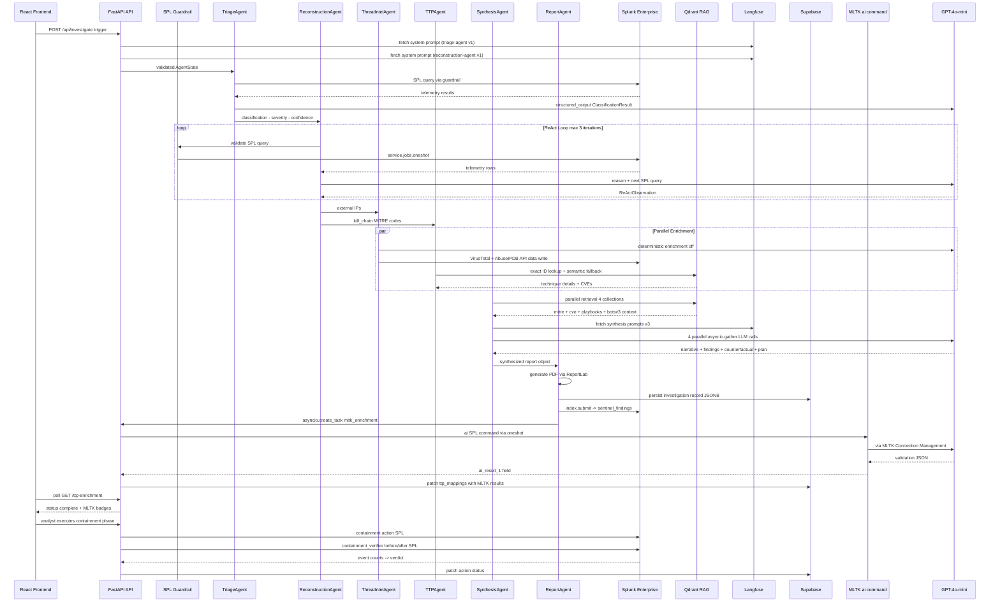

# Splunk Sentinel - Architecture Diagram

> Autonomous AI-powered SOC investigation platform.
> Splunk Agentic Ops Hackathon 2026 - Security Track
> Repo: github.com/Asembris/splunk-sentinel

---

## 1. Complete System Architecture

How the application interacts with Splunk,
how AI models and agents are integrated,
and data flow between all services and components.

```mermaid
graph TD
    %% External Trigger Sources
    SPLUNK_ALERT["Splunk Saved Search
    Threshold Breach Alert"]
    USER["Analyst
    Manual Trigger via UI"]

    %% Entry Points
    WEBHOOK["POST /api/webhook/splunk
    Autonomous Trigger"]
    INVESTIGATE["POST /api/investigate
    SSE Stream"]

    %% Splunk Platform
    subgraph SPLUNK ["Splunk Enterprise 10.2.2"]
        BOTSV3[("index=botsv3
        2083056 events
        20 sourcetypes")]
        SENTINEL_FINDINGS[("index=sentinel_findings
        Notable Events
        Investigation Write-back")]
        SENTINEL_ACTIONS[("index=sentinel_actions
        Containment Audit Trail
        Action Verification")]
        MLTK_APP["MLTK 5.7.4 + PSC 4.3.2
        ai SPL command
        Connection: openai_sentinel"]
        SPLUNK_APP["sentinel.spl App Package
        One-click install
        indexes + dashboard + savedsearches"]
        SPLUNK_DASHBOARD["Native Splunk Dashboard
        4 panels - sentinel_findings
        sentinel_actions"]
    end

    %% FastAPI Backend
    subgraph BACKEND ["FastAPI Backend Port 8001"]
        GUARDRAIL["3-Layer SPL Guardrail
        Layer 1: Keyword Block 0ms
        Layer 2: Index Authorization
        Layer 3: Hash-Chained Audit Log"]
        AUDIT["SHA-256 Hash Chain
        Tamper-Evident Audit Log
        GET /api/audit-log/verify"]
        PROMPT_LOADER["Langfuse PromptOps
        prompt_loader.py
        3-layer fallback - 5min TTL cache"]
    end

    %% LangGraph Agent Pipeline
    subgraph PIPELINE ["LangGraph Agent Pipeline - 6 Agents"]
        TRIAGE["TriageAgent
        gpt-4o-mini
        Classification - Severity - SPL Routing
        Langfuse: triage-agent v1"]
        RECON["ReconstructionAgent
        gpt-4o-mini - ReAct max 3 iter
        Iterative SPL Generation
        Kill Chain - Patient Zero - Blast Radius
        Langfuse: reconstruction-agent v1"]

        subgraph PARALLEL ["Parallel Fan-out via LangGraph Send API"]
            THREAT["ThreatIntelAgent
            Deterministic - No LLM
            VirusTotal v3 + AbuseIPDB v2
            RFC1918 filter"]
            TTP["TTPAgent
            Qdrant RAG lookup
            MITRE ATT&CK - CVE Linking
            MLTK async validation"]
        end

        SYNTHESIS["SynthesisAgent
        gpt-4o-mini - 4 parallel LLM calls
        RAG Retrieval - Report Generation
        Graceful degradation fallbacks
        Langfuse: synthesis-narrative v1
        synthesis-containment v1
        synthesis-counterfactual v1"]
        REPORT["ReportAgent
        PDF via ReportLab
        Supabase persistence
        Splunk write-back
        MLTK async task fire"]
    end

    %% Post-Pipeline Services
    subgraph POST_PIPELINE ["Post-Pipeline Services - analyst-triggered"]
        CONTAIN_ENGINE["containment_engine
        3-phase IR plan execution
        SSE streaming - rollback SPL"]
        CONTAIN_CHAT["containment_chat
        ContainmentRefinementAgent
        ReAct tool calling
        Langfuse: containment-refinement v1"]
        CONTAIN_VERIFY["containment_verifier
        Deterministic SPL verification
        before/after event counts
        VERIFIED_EFFECTIVE - PARTIAL_EFFECT
        VERIFICATION_FAILED - ROLLBACK_RECOMMENDED"]
        DETECT_GAP["detection_gap_analyzer
        MITRE coverage vs saved searches
        LLM SPL generation
        one-click deploy via SDK"]
        MLTK_ENRICH["mltk_enrichment
        Async post-investigation
        MLTK ai command validation
        agreements=4 verified
        Qdrant 60pct + MLTK 40pct"]
    end

    %% AI Models
    subgraph AI_MODELS ["AI Models"]
        GPT["GPT-4o-mini
        OpenAI API
        SPL generation - reasoning - synthesis
        Cost: approx $0.009 per investigation"]
        EMBED["text-embedding-3-large
        OpenAI API
        3072 dimensions"]
    end

    %% RAG Knowledge Base
    subgraph RAG ["Qdrant Cloud - RAG Knowledge Base"]
        MITRE_C[("mitre_attack
        697 techniques
        Enterprise STIX")]
        CVE_C[("cve_nvd
        botsv3 CVE corpus")]
        PLAY_C[("ir_playbooks
        APT - Ransomware - Insider")]
        BOTS_C[("botsv3_investigation
        Forensic ground truth")]
    end

    %% PromptOps
    subgraph PROMPTOPS ["PromptOps - Langfuse Cloud"]
        LF_PROMPTS["6 versioned prompts
        triage-agent v1
        reconstruction-agent v1
        synthesis-narrative v1
        synthesis-containment v1
        synthesis-counterfactual v1
        containment-refinement v1
        label: production"]
        LF_HEALTH["Health endpoint reports
        promptops: langfuse
        prompt versions + labels"]
    end

    %% Persistence
    subgraph PERSISTENCE ["Persistence Layer"]
        SUPABASE[("Supabase PostgreSQL
        investigations table
        JSONB report_json storage
        analyst feedback")]
        PDF_STORE[("Local PDF Store
        backend/reports/
        ReportLab generated")]
    end

    %% Observability
    subgraph OBS ["Observability"]
        LANGSMITH["LangSmith
        Full pipeline tracing
        Token - Latency - Cost per call"]
    end

    %% Frontend
    subgraph FRONTEND ["React Frontend Port 5173"]
        DASHBOARD_UI["Dashboard
        Live SSE Stream
        Kill Chain Graph - Event Feed"]
        REPORT_PAGE["Report Page
        PDF Download - Audit Badge
        MLTK badges - Confidence breakdown
        Containment plan + verification
        Detection gap analysis"]
        HISTORY_UI["History Page
        Supabase-backed
        Persistent investigation records"]
    end

    %% Splunk triggers
    SPLUNK_APP -->|installs| SENTINEL_FINDINGS
    SPLUNK_APP -->|installs| SENTINEL_ACTIONS
    SPLUNK_APP -->|installs| SPLUNK_DASHBOARD
    SPLUNK_ALERT -->|HTTP POST webhook| WEBHOOK
    USER -->|trigger text| INVESTIGATE
    WEBHOOK --> GUARDRAIL
    INVESTIGATE --> GUARDRAIL

    %% Guardrail -> Pipeline
    GUARDRAIL --> AUDIT
    GUARDRAIL --> TRIAGE

    %% PromptOps
    PROMPT_LOADER -->|fetch at startup + runtime| LF_PROMPTS
    LF_PROMPTS -->|system prompts| TRIAGE
    LF_PROMPTS -->|system prompts| RECON
    LF_PROMPTS -->|system prompts| SYNTHESIS
    LF_PROMPTS -->|system prompts| CONTAIN_CHAT
    LF_HEALTH -->|included in| PROMPT_LOADER

    %% Pipeline flow
    TRIAGE -->|APT - Ransomware - Insider| RECON
    TRIAGE -->|UNKNOWN| END1["END - Escalate to Human"]
    RECON -->|fan-out| THREAT
    RECON -->|fan-out| TTP
    THREAT -->|merge| SYNTHESIS
    TTP -->|merge| SYNTHESIS
    SYNTHESIS --> REPORT

    %% Splunk data queries
    TRIAGE <-->|SPL queries via SDK| BOTSV3
    RECON <-->|iterative ReAct SPL| BOTSV3
    REPORT -->|index.submit SDK| SENTINEL_FINDINGS

    %% AI Models
    TRIAGE <-->|structured output| GPT
    RECON <-->|ReAct reasoning| GPT
    SYNTHESIS <-->|4 parallel LLM calls| GPT
    EMBED -->|index vectors| MITRE_C
    EMBED -->|index vectors| CVE_C
    EMBED -->|index vectors| PLAY_C
    EMBED -->|index vectors| BOTS_C

    %% RAG retrieval
    TTP <-->|exact ID + semantic| MITRE_C
    TTP <-->|CVE linking| CVE_C
    SYNTHESIS <-->|parallel 4-collection retrieval| MITRE_C
    SYNTHESIS <-->|parallel retrieval| CVE_C
    SYNTHESIS <-->|parallel retrieval| PLAY_C
    SYNTHESIS <-->|parallel retrieval| BOTS_C

    %% Post-pipeline
    REPORT -->|fire async task| MLTK_ENRICH
    MLTK_ENRICH <-->|ai SPL command| MLTK_APP
    MLTK_APP <-->|Connection Management| GPT
    MLTK_ENRICH -->|patch ttp_mappings| SUPABASE

    %% Persistence
    REPORT --> SUPABASE
    REPORT --> PDF_STORE

    %% Post-pipeline services
    CONTAIN_ENGINE -->|SSE execution| SENTINEL_ACTIONS
    CONTAIN_ENGINE -->|fire async| CONTAIN_VERIFY
    CONTAIN_VERIFY <-->|before/after SPL| BOTSV3
    CONTAIN_VERIFY -->|patch action status| SUPABASE
    CONTAIN_CHAT <-->|ReAct tool calls| CONTAIN_ENGINE
    CONTAIN_CHAT <-->|LLM reasoning| GPT
    DETECT_GAP <-->|list saved searches| SPLUNK_APP
    DETECT_GAP -->|create saved search| SPLUNK_APP

    %% Observability
    TRIAGE -.->|traces| LANGSMITH
    RECON -.->|traces| LANGSMITH
    SYNTHESIS -.->|traces| LANGSMITH

    %% Frontend
    REPORT_PAGE <-->|SSE stream| INVESTIGATE
    REPORT_PAGE <-->|PDF download| PDF_STORE
    REPORT_PAGE <-->|audit verify| AUDIT
    REPORT_PAGE <-->|containment plan| CONTAIN_ENGINE
    REPORT_PAGE <-->|containment chat| CONTAIN_CHAT
    REPORT_PAGE <-->|MLTK enrichment poll| MLTK_ENRICH
    REPORT_PAGE <-->|detection gaps| DETECT_GAP
    HISTORY_UI <-->|history API| SUPABASE
    DASHBOARD_UI <-->|SSE stream| INVESTIGATE

    style SPLUNK fill:#1a1a2e,stroke:#ff5a1f
    style BACKEND fill:#1e3a5f,stroke:#3b82f6
    style PIPELINE fill:#1a2e1a,stroke:#10b981
    style POST_PIPELINE fill:#1a1a2e,stroke:#8b5cf6
    style AI_MODELS fill:#2d1b1b,stroke:#ef4444
    style RAG fill:#1a1a2e,stroke:#8b5cf6
    style PROMPTOPS fill:#2a1a2e,stroke:#8b5cf6
    style PERSISTENCE fill:#1e2a1e,stroke:#10b981
    style OBS fill:#2a1a2e,stroke:#8b5cf6
    style FRONTEND fill:#1e3a5f,stroke:#60a5fa
    style PARALLEL fill:#0f1a0f,stroke:#10b981
```



---

## 2. How The Application Interacts With Splunk

Splunk is the data source, the AI inference layer,
and the output destination simultaneously.

### Detection (Splunk -> Sentinel)

Splunk saved search monitors botsv3 for attack
patterns. When a threshold is breached:

```text
Saved Search fires -> Webhook Alert Action ->
POST http://localhost:8001/api/webhook/splunk ->
Sentinel pipeline starts autonomously
```

Configured saved search (included in sentinel.spl):

```spl
index=botsv3 earliest=0 sourcetype=stream:http
dest_ip=169.254.169.254
| stats count by src_ip
| where count > 5
```

### Investigation (Sentinel queries Splunk)

Every SPL query passes through the 3-layer guardrail
before execution via Splunk Python SDK 1.7.4:

```text
Agent generates SPL ->
Layer 1: keyword block 0ms ->
Layer 2: index authorization ->
Layer 3: SHA-256 audit log entry ->
service.jobs.oneshot() ->
results returned to agent
```

### Response (Sentinel -> Splunk write-back)

After investigation completes, ReportAgent writes
findings back to Splunk via SDK:

```python
service.indexes["sentinel_findings"].submit(
    json.dumps(event),
    sourcetype="sentinel:investigation"
)
```

Verify in Splunk:

```spl
index=sentinel_findings earliest=0
sourcetype="sentinel:investigation"
| table investigation_id, classification,
        confidence_tier, kill_chain_summary,
        patient_zero_ip, severity
```

### MLTK AI Toolkit (Splunk-native AI)

After investigation persists, `mltk_enrichment.py`
fires as a background task and validates MITRE
technique mappings using Splunk's own ai command:

```spl
| makeresults count=1
| eval evidence="HTTP requests to 169.254.169.254..."
| ai connection="openai_sentinel"
    prompt="Validate MITRE technique: {qdrant_technique}
    Evidence: {evidence}
    Return JSON: technique_id, confidence, reasoning"
```

Results: agreements=4, disagreements=0, failed=0
Enrichment time: approx 30s parallel async

### Containment Verification (Sentinel -> Splunk)

After each containment action executes,
`containment_verifier.py` runs SPL to prove
measurable effect on telemetry:

```spl
search index=botsv3 earliest=-10m
(src_ip="{target}" OR dest_ip="{target}")
| stats count
```

Verdicts: VERIFIED_EFFECTIVE - PARTIAL_EFFECT -
VERIFICATION_FAILED - ROLLBACK_RECOMMENDED

### Splunk App Package (sentinel.spl)

The `sentinel.spl` file packages all Splunk components
for one-click installation:

- `default/indexes.conf`: sentinel_findings and
  sentinel_actions index definitions
- `default/savedsearches.conf`: webhook saved search
- `default/authorize.conf`: 3 MLTK capabilities for
  role_admin
- `default/data/ui/views/sentinel_dashboard.xml`:
  4-panel native Splunk dashboard
- `default/props.conf` and `transforms.conf`: sourcetype
  definitions

Install: Apps -> Manage Apps -> Install app from file
-> Upload sentinel.spl -> Restart Splunk

## 3. How AI Models and Agents Are Integrated

### Agent Pipeline (LangGraph State Machine)

6 agents run as LangGraph graph nodes with a shared
`AgentState` TypedDict (25+ fields):

```text
TriageAgent -> ReconstructionAgent ->
[ThreatIntelAgent || TTPAgent] -> (parallel)
SynthesisAgent -> ReportAgent
```

Each agent reads from and writes to AgentState.
LangGraph manages routing and parallel fan-out.

### LLM Integration (GPT-4o-mini exclusively)

All 6 LLM-using agents call gpt-4o-mini via
langchain-openai with structured output:

- TriageAgent: `ClassificationResult` Pydantic model
- ReconstructionAgent: `ReActObservation` Pydantic model
- SynthesisAgent: 4 parallel `asyncio.gather()` calls
- narrative generation
- structured findings
- counterfactual reasoning
- containment plan
- ContainmentRefinementAgent: ReAct tool calling

Total cost: approx $0.009 per investigation

### PromptOps (Langfuse)

All 6 agent system prompts are managed in Langfuse
with version control and production labels:

```text
Langfuse Cloud (source of truth)
-> 5-min TTL cache (Langfuse SDK)
-> in-memory fallback (last successful fetch)
-> hardcoded fallback (always present in agent)
```

Startup validation confirms all 6 prompts accessible.
Health endpoint reports: "promptops": "langfuse"

Prompt versions:

- triage-agent v1 production
- reconstruction-agent v1 production
- synthesis-narrative v1 production
- synthesis-containment v1 production
- synthesis-counterfactual v1 production
- containment-refinement v1 production

### MLTK Integration (Splunk-native AI)

MLTK 5.7.4 + PSC 4.3.2 (Windows) installed.
Connection Management: openai_sentinel -> gpt-4o-mini
MLTK runs as async post-pipeline enrichment, never
blocking the 120s investigation SLO. Confidence
weighting: Qdrant 60pct + MLTK 40pct on agreement.

### RAG Integration (Qdrant)

4 collections, 697+ MITRE techniques + CVEs +
IR playbooks + botsv3 forensic notes.
Embedding: text-embedding-3-large, 3072 dimensions.
Retrieval threshold: 0.45 semantic similarity.
TTPAgent: exact technique ID lookup + semantic fallback.
SynthesisAgent: parallel retrieval from all 4
collections before report generation.

## 4. Data Flow Between Services, APIs, and Components



## 5. Post-Pipeline Services Architecture

After the 6-agent pipeline completes and the
investigation is persisted, analysts can trigger
5 post-pipeline services from the React UI:

```text
Investigation persisted in Supabase
        |
        +---> mltk_enrichment (auto-fires async)
        |     MLTK ai command validates TTP mappings
        |     ~30s parallel, never blocks SLO
        |
        +---> containment_engine (analyst-triggered)
        |     Executes 3-phase IR plan via SSE
        |     Writes to sentinel_actions index
        |       |
        |       +---> containment_verifier (auto-fires)
        |       |     SPL before/after event counts
        |       |     Patches action status in Supabase
        |       |
        |       +---> containment_chat (analyst-triggered)
        |             ContainmentRefinementAgent
        |             ReAct tool calling via SSE
        |
        +---> detection_gap_analyzer (analyst-triggered)
              MITRE coverage vs Splunk saved searches
              LLM generates recommended detection SPL
              One-click deploy via Splunk SDK
```

All post-pipeline services follow this pattern:

- Never block investigation delivery
- Patch results to Supabase permanently
- Frontend polls for updates (no page refresh needed)

## 6. Security Architecture

### SPL Guardrail - 3 Layers

Every LLM-generated SPL query is validated before
execution against Splunk:

Layer 1 - Deterministic 0ms (no LLM):

- Blocks: DELETE, DROP, outputlookup overwrite=true
- Blocks: sendemail, _internal, _audit indexes
- Blocks: subsearch injection [search index=_internal]
- Blocks: backtick macros, IN operator multi-index
- Blocks: rest command

Layer 2 - Index Authorization:

- Permits: index=botsv3 (read only)
- Permits: index=sentinel_findings (write)
- Permits: index=sentinel_actions (write)
- Blocks: all other indexes

Layer 3 - SHA-256 Hash Chain:

- Every query attempt recorded (blocked or executed)
- entry_hash = SHA-256(prev_hash + canonical JSON)
- Modifying any entry breaks all subsequent hashes
- Verify: GET /api/audit-log/verify/{investigation_id}
- Returns: valid, total_entries, chain_intact

### Prompt Injection Protection

`telemetry_sanitizer.py` scans all Splunk result rows
before LLM injection. Detects and redacts 6 categories:

- INSTRUCTION_OVERRIDE
- ROLE_REASSIGNMENT
- CLASSIFICATION_MANIPULATION
- TERMINATION_INJECTION
- SYSTEM_PROMPT_EXTRACTION
- LLM_MANIPULATION

Preserves legitimate forensic evidence:
`cmd.exe` arguments, WMIC commands, AWS URIs, etc.

## 7. Tech Stack Summary

| Layer | Technology | Version | Role |
|---|---|---|---|
| Agent Orchestration | LangGraph | 0.2 | State machine - parallel fan-out |
| LLM | GPT-4o-mini | OpenAI | SPL generation - reasoning - synthesis |
| Security Platform | Splunk Enterprise | 10.2.2 | Log ingestion - search - write-back |
| Dataset | BOTS v3 | - | 2083056 events - APT simulation |
| Vector Store | Qdrant Cloud | 1.11 | 4 collections - 3072-dim embeddings |
| Embeddings | text-embedding-3-large | OpenAI | Semantic RAG retrieval |
| Backend | FastAPI | 0.115 | REST API - SSE streaming - webhook |
| Frontend | React 18 + Vite | 18/5.0 | Real-time dashboard - kill chain graph |
| Persistence | Supabase PostgreSQL | - | Investigation history - analyst feedback |
| PromptOps | Langfuse | 3.14.6 | 6 versioned prompts - production labels |
| AI Toolkit | Splunk MLTK | 5.7.4 | Native Splunk ai command - TTP validation |
| ML Runtime | Python for Scientific Computing | 4.3.2 | MLTK Windows dependency |
| PDF | ReportLab | 4.2.2 | Structured incident report generation |
| Audit | SHA-256 hash chain | Custom | Tamper-evident SPL audit log |
| Observability | LangSmith | - | Full pipeline tracing - cost tracking |
| Threat Intel | VirusTotal + AbuseIPDB | v3/v2 | IP reputation enrichment |
| Evaluation | DeepEval | - | 15 goldens - 93.3pct pass rate |
| Tests | pytest | - | 397 passing - deterministic |

## 8. Key Metrics

| Metric | Value |
|---|---|
| Total pipeline latency | approx 100 seconds end-to-end |
| MLTK async enrichment | approx 30 seconds parallel |
| Cost per investigation | approx $0.009 |
| MITRE ATT&CK techniques | 697 indexed in Qdrant |
| Unit tests | 397 passing - deterministic |
| API contract tests | 27 passing - mocked |
| DeepEval pass rate | 93.3pct (14/15 goldens) |
| Splunk events analyzed | 2083056 (botsv3) |
| AI agents (LangGraph) | 6 pipeline agents |
| Post-pipeline services | 5 (containment + analysis) |
| PromptOps prompts | 6 versioned in Langfuse |
| SPL guardrail layers | 3 (deterministic - 0ms - no LLM) |
| Audit chain algorithm | SHA-256 per entry |
| Containment verdicts | 4 types (VERIFIED_EFFECTIVE etc) |
| sentinel_findings events | 183 (live data) |
| sentinel_actions events | 71 (live data) |

---

## VERIFICATION

```powershell
# Confirm file was updated
(Get-Item architecture_diagram.md).Length

# Confirm key sections present
Select-String -Path "architecture_diagram.md" `
    -Pattern "sentinel.spl"
Select-String -Path "architecture_diagram.md" `
    -Pattern "Langfuse"
Select-String -Path "architecture_diagram.md" `
    -Pattern "mltk_enrichment"
Select-String -Path "architecture_diagram.md" `
    -Pattern "containment_verifier"
Select-String -Path "architecture_diagram.md" `
    -Pattern "397"
Select-String -Path "architecture_diagram.md" `
    -Pattern "post-pipeline"
```
