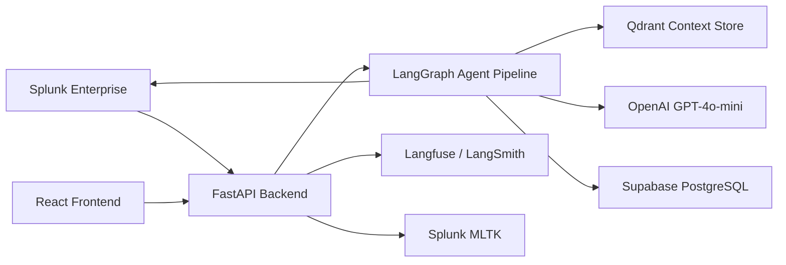
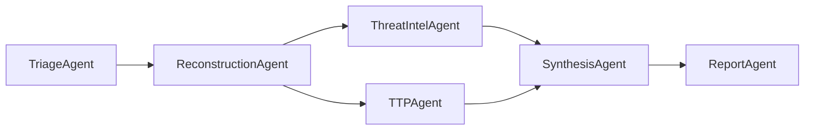
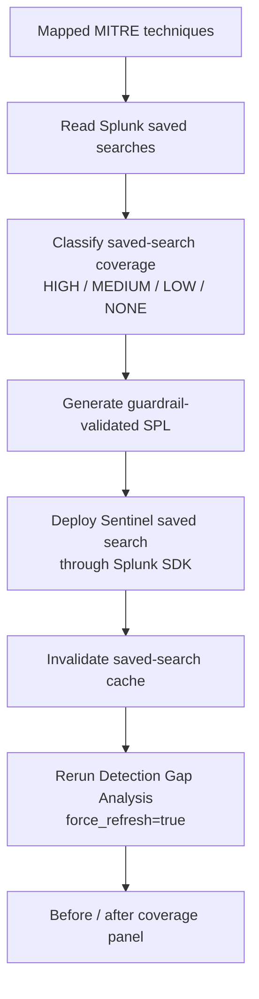
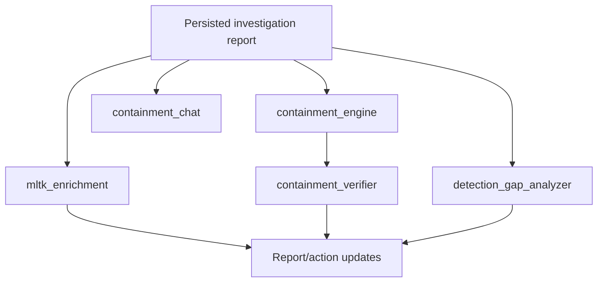

# Splunk Sentinel — Architecture

Agentic SOC investigation platform for Splunk Enterprise. Security-track hackathon submission.

## 1. Executive Architecture Summary

- Splunk alerting or a manual investigation trigger starts an incident workflow from Splunk telemetry.
- FastAPI coordinates a LangGraph agent pipeline that triages, reconstructs, enriches, synthesizes, and persists investigation output.
- The backend uses the Splunk Python SDK to execute guarded SPL against `index=botsv3` and to create governed Splunk saved searches.
- ReportAgent persists the final report to Supabase/PDF and writes completed findings back to Splunk in `sentinel_findings`.
- Post-pipeline services handle human-in-the-loop containment, MLTK enrichment, and Detection Gap Analysis without blocking report delivery.
- Closed-loop detection coverage deploys generated saved searches, invalidates cached saved-search metadata, and re-measures saved-search coverage with `force_refresh=true`.

## 2. Architecture-to-Criteria Mapping

| Criterion | Architecture evidence |
| --- | --- |
| Technological Implementation | FastAPI, LangGraph, Splunk SDK `splunk-sdk==2.0.2`, guarded SPL execution, Qdrant RAG context, Supabase persistence, MLTK enrichment, and 425 passing backend tests with eval tests excluded. |
| Design | The system separates the core investigation pipeline from post-pipeline services, keeps Splunk central as both source and destination, and reconciles final dashboard state from the terminal COMPLETE payload/persisted report. |
| Potential Impact | Analysts can move from Splunk alert to reconstructed attack path, confidence breakdown, audit trail, containment guidance, and saved-search coverage posture in one workflow. |
| Quality of the Idea | The architecture closes the loop inside Splunk: investigate telemetry, write findings, deploy saved-search coverage, and re-measure coverage posture without claiming real-world prevention. |

## 3. High-Level System Overview



Splunk Sentinel keeps Splunk Enterprise at the center of the architecture. Splunk provides the investigation telemetry, the backend queries it through the SDK, and final operational artifacts are written back into Splunk indexes or saved-search objects.

## 4. Splunk Integration Architecture


- Splunk saved searches or manual analyst input can start an investigation through the backend API.
- The backend uses Splunk Python SDK `splunk-sdk==2.0.2` against Splunk Enterprise 10.2.2.
- SDK management-port authentication uses `SPLUNK_HOST`, `SPLUNK_PORT`, `SPLUNK_USERNAME`, and `SPLUNK_PASSWORD`; browser Splunk UI login is irrelevant to the backend SDK session.
- SPL search execution is guarded and targets investigation telemetry in `index=botsv3`.
- Findings are written to `sentinel_findings`; containment and audit actions are written to `sentinel_actions`.
- Detection Gap Analysis reads existing Splunk saved searches and creates new Sentinel saved searches through the SDK.
- SDK search and saved-search deployment paths retry once on supported session/auth errors, including expired SDK sessions.
- MLTK `ai` enrichment runs asynchronously when Splunk MLTK 5.7.4 and the `openai_sentinel` connection are configured.
- The `sentinel.spl` Splunk app installs required indexes, dashboard assets, saved searches, and configuration for the demo environment.

## 5. LangGraph Investigation Pipeline



- Reconstruction uses a bounded ReAct loop so the investigation can reason over Splunk evidence without running unbounded searches.
- Threat intelligence enrichment and TTP mapping run in parallel after reconstruction.
- Structured outputs are used where the pipeline needs predictable report fields and downstream rendering.
- Core LLM reasoning uses OpenAI GPT-4o-mini; deterministic services handle API-style enrichment and guardrail checks where appropriate.
- Threat intelligence enrichment is deterministic/API-based rather than a free-form LLM-only step.
- Containment refinement uses ReAct tool calling while keeping execution under analyst control.
- Final report synthesis produces the persisted report, and the frontend reconciles live dashboard state from the terminal COMPLETE state and persisted report data.

## 6. Closed-Loop Saved-Search Coverage Architecture



Detection Gap Analysis measures saved-search coverage posture, not attack prevention or execution-validated detection quality.

The workflow:

1. Start from MITRE techniques mapped in the investigation report.
2. Read Splunk saved searches and classify coverage as HIGH, MEDIUM, LOW, or NONE.
3. Generate guardrail-validated SPL for uncovered techniques.
4. Deploy a Sentinel saved search through the Splunk SDK.
5. Return `coverage_refresh_recommended` and invalidate the saved-search cache.
6. Rerun Detection Gap Analysis with `force_refresh=true`.
7. Compare baseline and refreshed saved-search coverage in the report UI.

The before/after panel uses normalized technique IDs only. It reports newly covered techniques, gaps closed, moved-to-review techniques, remaining gaps, and saved searches checked before/after. Gaps are counted as closed only when a baseline gap becomes HIGH/MEDIUM covered in the refreshed result.

Sentinel saved searches are matched by exact technique ID in names/descriptions. Parent and sub-technique matching is intentionally conservative; for example, `T1547` should not accidentally satisfy `T1547.001`.

## 7. Post-Pipeline Services



Post-pipeline services run asynchronously or analyst-triggered after the primary investigation is persisted:

- `mltk_enrichment` patches report mappings with `MLTK Validated`, `MLTK Review`, or `NOT RUN` states. `NOT RUN` means enrichment has not completed or was unavailable for that investigation.
- `containment_engine` generates and executes analyst-approved Splunk actions against governed action indexes.
- `containment_verifier` measures before/after telemetry counts and records a verification verdict; it does not establish real-world containment outcomes.
- `containment_chat` supports analyst refinement of containment plans.
- `detection_gap_analyzer` reads saved searches, generates guarded SPL, deploys Sentinel saved searches, and re-measures saved-search coverage.

These services do not block initial report delivery. They patch persisted report/action records, and the frontend polls or streams updates while the analyst remains in control for containment.

## 8. Security, Trust, and Guardrails

- SPL generation and execution use layered guardrails: query-shape checks, placeholder blocking, and safe execution constraints before UI/deploy.
- Investigation SPL is read-only against `index=botsv3`.
- Write-back is isolated to Sentinel indexes: `sentinel_findings` for completed investigations and `sentinel_actions` for containment/action audit events.
- The audit chain uses SHA-256 hash links so investigation and action entries can be verified later.
- Telemetry rows are sanitized for prompt-injection patterns before LLM-facing processing.
- Containment is human-in-the-loop; generated actions require analyst approval before execution.
- Confidence reporting separates evidence confidence, factor breakdowns, inferred/confirmed attack-path stages, and analyst feedback.
- MLTK enrichment is additive context, not a claim that every technique was validated.

## 9. Persistence, Checkpointing, and Observability

- Supabase PostgreSQL stores investigation reports as JSONB so the report can be reopened and patched by post-pipeline services.
- ReportLab 4.2.2 generates local PDF reports for analyst handoff.
- LangGraph checkpointing uses `AsyncSqliteSaver` with local `backend/checkpoints.db` for single-node demo/local durability.
- `GET /api/investigations/{id}/checkpoint-status` reports checkpoint availability.
- `POST /api/investigations/{id}/resume` resumes an interrupted investigation from checkpoint state.
- LangSmith tracing is available when configured.
- Langfuse PromptOps is used when configured, with internal prompt-loader fallback to memory cache or built-in hardcoded prompts.
- Current `/api/health` behavior: `promptops` returns `"langfuse"` unconditionally. If Langfuse credentials are missing or Langfuse is unreachable, `prompt_versions` entries may be empty objects while the prompt loader internally falls back to memory cache or built-in hardcoded prompts.
- The health endpoint exposes core prompt metadata only; it should not be read as every configured prompt or as a full PromptOps fallback-state indicator.

## 10. Tech Stack and Verification

| Layer | Current implementation |
| --- | --- |
| Backend runtime | Python 3.12 |
| API framework | FastAPI 0.115 |
| Frontend | React 18 + Vite |
| Splunk platform | Splunk Enterprise 10.2.2 |
| Splunk SDK | `splunk-sdk==2.0.2` |
| Agent orchestration | LangGraph 0.2 |
| LLM | OpenAI GPT-4o-mini |
| Retrieval context | Qdrant Cloud for MITRE, CVE, playbook, and botsv3 context |
| Report persistence | Supabase PostgreSQL JSONB |
| PromptOps | Langfuse 3.14.6 when configured |
| Tracing | LangSmith when configured |
| MLTK enrichment | Splunk MLTK 5.7.4 + PSC 4.3.2 when configured |
| PDF export | ReportLab 4.2.2 |
| Checkpointing | `AsyncSqliteSaver` / SQLite checkpointing |
| Tests | 425 passing backend tests with eval tests excluded |

Evaluation tests are directional and can be rerun separately with:

```powershell
python -m pytest tests/eval/ -v
```

## 11. Verification Checklist

- Run the backend and frontend.
- Check `GET /api/health`.
- Start a Splunk Sentinel investigation from a Splunk alert or manual trigger.
- Open the generated report.
- View the audit chain and verify hash integrity.
- Open Detection Gap Analysis.
- Deploy a generated saved search.
- Rerun coverage with `force_refresh=true`.
- Verify Splunk saved searches and write-back indexes `sentinel_findings` / `sentinel_actions`.
- Run backend tests with eval tests excluded.
