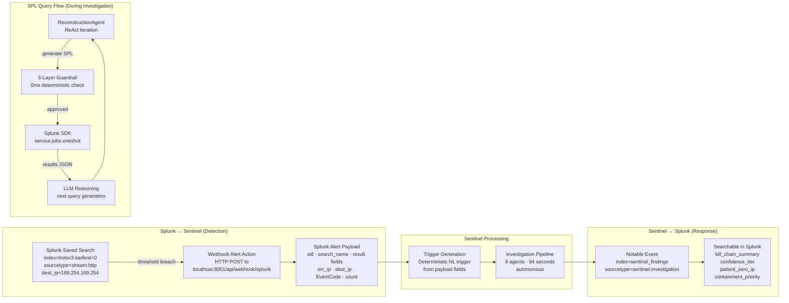
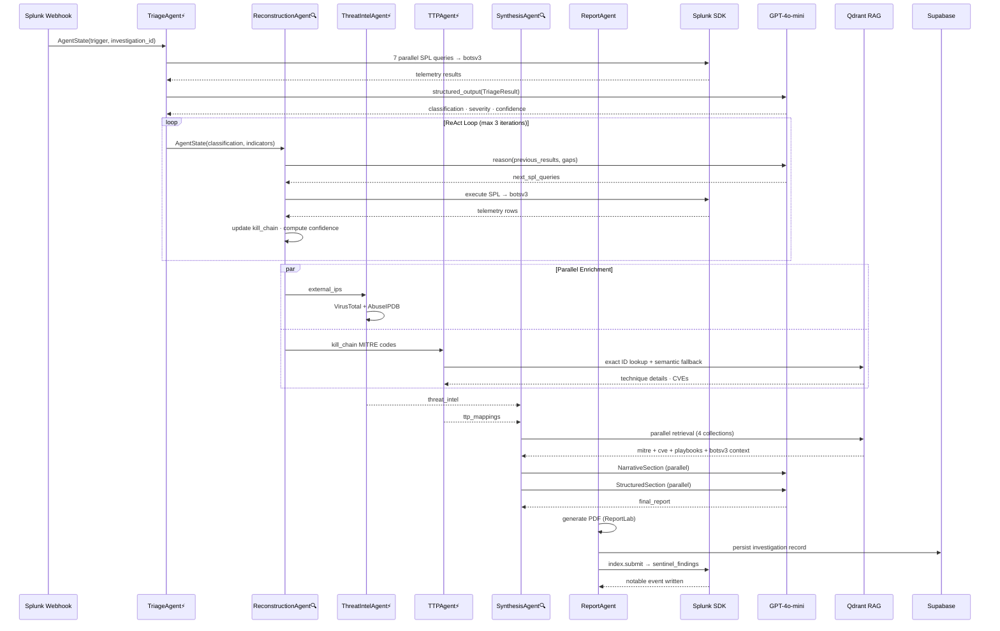
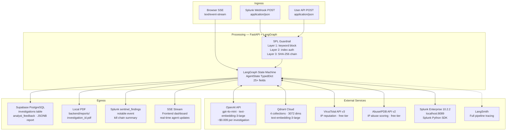
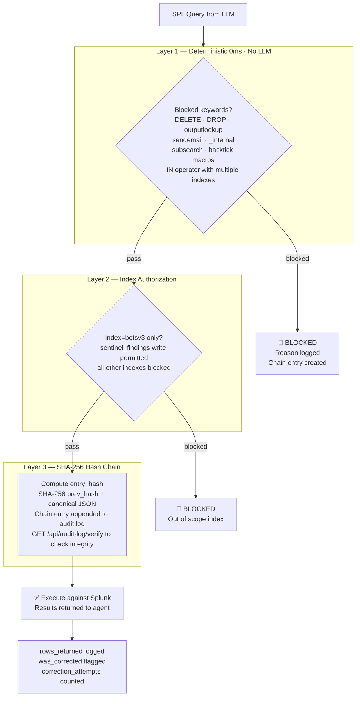

# Splunk Sentinel — Architecture Diagram

> Autonomous AI-powered SOC investigation platform.
> Splunk Agentic Ops Hackathon 2026 — Security Track

---

## 1. Complete System Architecture

```mermaid
graph TD
    %% External Trigger Sources
    SPLUNK_ALERT[🔔 Splunk Saved Search<br/>Threshold Breach Alert]
    USER[👤 Analyst<br/>Manual Trigger]

    %% Entry Points
    WEBHOOK[POST /api/webhook/splunk<br/>Autonomous Trigger]
    INVESTIGATE[POST /api/investigate<br/>SSE Stream]

    %% Splunk Integration
    subgraph SPLUNK ["🔍 Splunk Enterprise 10.2.2"]
        BOTSV3[(index=botsv3<br/>2,083,056 events<br/>20 sourcetypes)]
        SENTINEL_IDX[(index=sentinel_findings<br/>Notable Events<br/>Write-back)]
        SAVED_SEARCH[Saved Search<br/>Sentinel - AWS Metadata<br/>Access Detected]
    end

    %% FastAPI Backend
    subgraph BACKEND ["⚙️ FastAPI Backend (Port 8001)"]
        GUARDRAIL[3-Layer SPL Guardrail<br/>Layer 1: Keyword Block 0ms<br/>Layer 2: Index Authorization<br/>Layer 3: Hash-Chained Audit Log]
        AUDIT[SHA-256 Hash Chain<br/>Tamper-Evident Audit Log]
    end

    %% LangGraph Agent Pipeline
    subgraph PIPELINE ["🤖 LangGraph Agent Pipeline"]
        TRIAGE[⚡ TriageAgent<br/>FAST · gpt-4o-mini<br/>Classification · Severity · Routing]
        RECON[🔍 ReconstructionAgent<br/>DEEP · ReAct Loop max 3 iter<br/>Iterative SPL Generation<br/>Kill Chain · Patient Zero · Blast Radius]
        
        subgraph PARALLEL ["Parallel Fan-out via LangGraph Send API"]
            THREAT[⚡ ThreatIntelAgent<br/>FAST · Deterministic<br/>VirusTotal · AbuseIPDB]
            TTP[⚡ TTPAgent<br/>FAST · RAG Lookup<br/>MITRE ATT&CK · CVE Linking]
        end
        
        SYNTHESIS[🔍 SynthesisAgent<br/>DEEP · gpt-4o-mini x2 parallel<br/>RAG Retrieval · Report Generation]
        REPORT[📄 ReportAgent<br/>PDF · Supabase · Splunk Write-back<br/>4-Tier Confidence Ladder]
    end

    %% AI Models
    subgraph AI_MODELS ["🧠 AI Models"]
        GPT[GPT-4o-mini<br/>OpenAI API<br/>SPL Generation · Reasoning · Synthesis]
        EMBED[text-embedding-3-large<br/>OpenAI API<br/>3072 dimensions]
    end

    %% RAG Knowledge Base
    subgraph RAG ["🗄️ Qdrant Cloud — RAG Knowledge Base"]
        MITRE_C[(mitre_attack<br/>697 techniques<br/>Enterprise STIX)]
        CVE_C[(cve_nvd<br/>botsv3 CVE corpus<br/>SSRF · RCE · PrivEsc)]
        PLAY_C[(ir_playbooks<br/>APT · Ransomware<br/>Insider · Brute Force)]
        BOTS_C[(botsv3_investigation<br/>Forensic ground truth<br/>BOTS v3 notes)]
    end

    %% Persistence
    subgraph PERSISTENCE ["💾 Persistence Layer"]
        SUPABASE[(Supabase PostgreSQL<br/>investigations table<br/>JSONB report storage)]
        PDF_STORE[(Local PDF Store<br/>backend/reports/<br/>ReportLab generated)]
    end

    %% Observability
    subgraph OBS ["📊 Observability"]
        LANGSMITH[LangSmith<br/>Full pipeline tracing<br/>Token · Latency · Cost]
    end

    %% Frontend
    subgraph FRONTEND ["🖥️ React Frontend (Port 5173)"]
        DASHBOARD[Dashboard<br/>Live SSE Stream<br/>Kill Chain Graph · Event Feed]
        REPORT_PAGE[Report Page<br/>PDF Download · Audit Badge<br/>Analyst Feedback]
        HISTORY[History Page<br/>Supabase-backed<br/>Persistent Records]
    end

    %% Flow: Splunk → Backend
    SAVED_SEARCH -->|threshold breach| SPLUNK_ALERT
    SPLUNK_ALERT -->|HTTP POST webhook payload| WEBHOOK
    USER -->|trigger text| INVESTIGATE
    WEBHOOK --> GUARDRAIL
    INVESTIGATE --> GUARDRAIL

    %% Flow: Guardrail → Pipeline
    GUARDRAIL --> AUDIT
    GUARDRAIL --> TRIAGE

    %% Flow: Agent Pipeline
    TRIAGE -->|APT/Ransomware/Insider| RECON
    TRIAGE -->|UNKNOWN| END1[🔚 Escalate to Human]
    RECON -->|fan-out| THREAT
    RECON -->|fan-out| TTP
    THREAT -->|merge| SYNTHESIS
    TTP -->|merge| SYNTHESIS
    SYNTHESIS --> REPORT

    %% Flow: Splunk Data
    TRIAGE <-->|SPL queries via SDK| BOTSV3
    RECON <-->|iterative SPL queries| BOTSV3
    REPORT -->|index.submit SDK| SENTINEL_IDX

    %% Flow: AI Models
    TRIAGE <-->|structured output| GPT
    RECON <-->|ReAct reasoning| GPT
    SYNTHESIS <-->|parallel LLM calls| GPT
    EMBED -->|3072-dim vectors| MITRE_C
    EMBED -->|3072-dim vectors| CVE_C
    EMBED -->|3072-dim vectors| PLAY_C
    EMBED -->|3072-dim vectors| BOTS_C

    %% Flow: RAG
    TTP <-->|exact ID + semantic| MITRE_C
    TTP <-->|CVE linking| CVE_C
    SYNTHESIS <-->|parallel retrieval| MITRE_C
    SYNTHESIS <-->|parallel retrieval| CVE_C
    SYNTHESIS <-->|parallel retrieval| PLAY_C
    SYNTHESIS <-->|parallel retrieval| BOTS_C

    %% Flow: Persistence
    REPORT --> SUPABASE
    REPORT --> PDF_STORE

    %% Flow: Observability
    TRIAGE -.->|traces| LANGSMITH
    RECON -.->|traces| LANGSMITH
    SYNTHESIS -.->|traces| LANGSMITH

    %% Flow: Frontend
    REPORT_PAGE <-->|SSE stream| INVESTIGATE
    REPORT_PAGE <-->|PDF download| PDF_STORE
    REPORT_PAGE <-->|audit verify| AUDIT
    HISTORY <-->|history API| SUPABASE
    DASHBOARD <-->|SSE stream| INVESTIGATE

    style SPLUNK fill:#1a1a2e,stroke:#ff5a1f
    style BACKEND fill:#1e3a5f,stroke:#3b82f6
    style PIPELINE fill:#1a2e1a,stroke:#10b981
    style AI_MODELS fill:#2d1b1b,stroke:#ef4444
    style RAG fill:#1a1a2e,stroke:#8b5cf6
    style PERSISTENCE fill:#1e2a1e,stroke:#10b981
    style OBS fill:#2a1a2e,stroke:#8b5cf6
    style FRONTEND fill:#1e3a5f,stroke:#60a5fa
    style PARALLEL fill:#0f1a0f,stroke:#10b981
```

---

## 2. Splunk Integration Detail

---

## 3. AI Agent Integration

---

## 4. Data Flow Between Services

---

## 5. Security Architecture

---

## 6. Tech Stack Summary

| Layer | Technology | Version | Role |
|:---|:---|:---|:---|
| Agent Orchestration | LangGraph | 0.2 | State machine · parallel fan-out · Send API |
| LLM | GPT-4o-mini | OpenAI | SPL generation · reasoning · synthesis |
| Security Platform | Splunk Enterprise | 10.2.2 | Log ingestion · search · write-back |
| Dataset | BOTS v3 | — | 2,083,056 events · APT simulation |
| Vector Store | Qdrant Cloud | 1.11 | 4 collections · 3072-dim embeddings |
| Embeddings | text-embedding-3-large | OpenAI | Semantic RAG retrieval |
| Backend | FastAPI | 0.115 | REST API · SSE streaming · webhook |
| Frontend | React 18 + Vite | 18/5.0 | Real-time dashboard · kill chain graph |
| Persistence | Supabase PostgreSQL | — | Investigation history · analyst feedback |
| PDF | ReportLab | 4.2.2 | Structured incident report generation |
| Audit | SHA-256 hash chain | Custom | Tamper-evident SPL audit log |
| Observability | LangSmith | — | Full pipeline tracing · cost tracking |
| Threat Intel | VirusTotal + AbuseIPDB | v3/v2 | IP reputation enrichment |
| Evaluation | DeepEval | — | 15 goldens · 93.3% pass rate |
| Tests | pytest | — | 169 unit tests · deterministic |

---

## 7. Key Metrics

| Metric | Value |
|:---|:---|
| Total pipeline latency | ~94 seconds end-to-end |
| Cost per investigation | ~$0.009 |
| MITRE ATT&CK techniques | 697 indexed in Qdrant |
| Unit tests | 169 passing (deterministic) |
| DeepEval pass rate | 93.3% (14/15 goldens) |
| Splunk events analyzed | 2,083,056 (botsv3) |
| AI agents | 6 specialized agents |
| SPL guardrail layers | 3 (deterministic · 0ms · no LLM) |
| Audit chain algorithm | SHA-256 per entry |
| Supabase investigations | Persistent across sessions |
